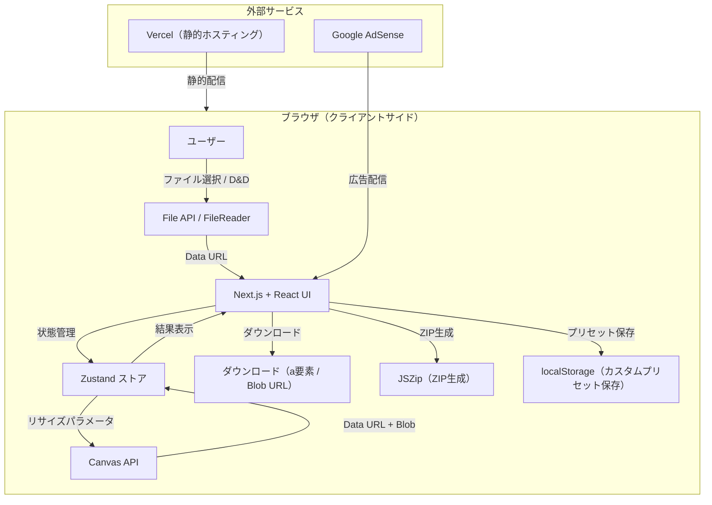
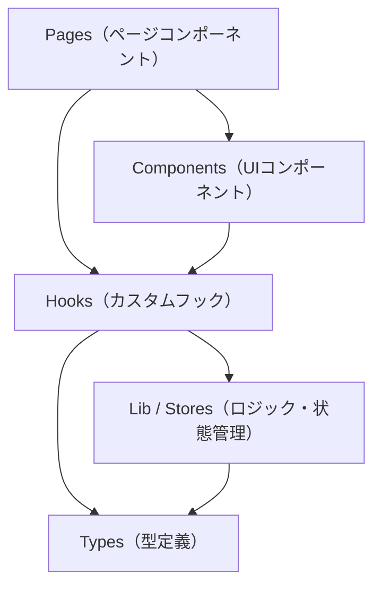
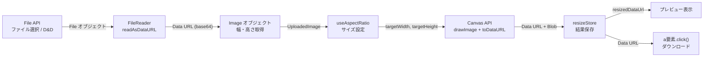
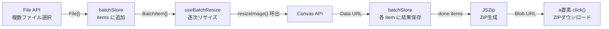
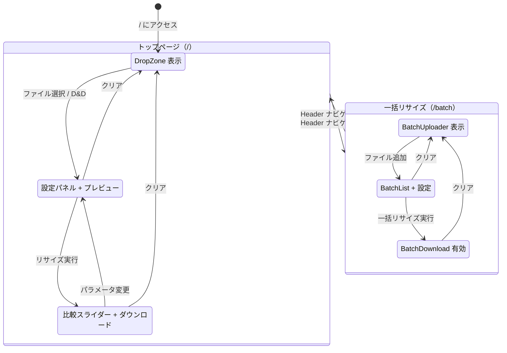
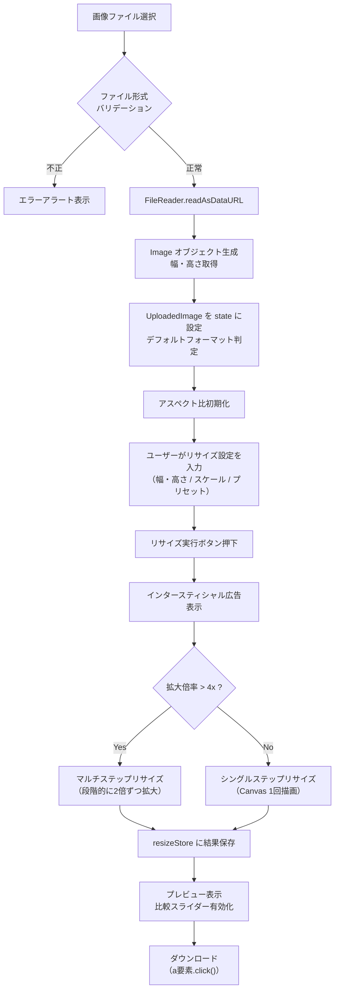
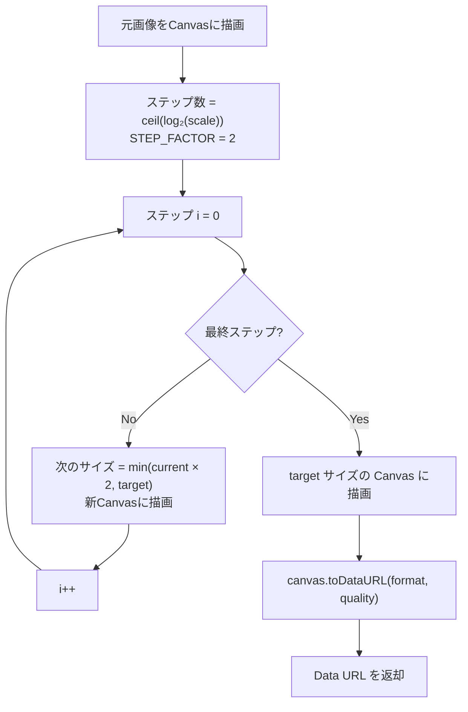
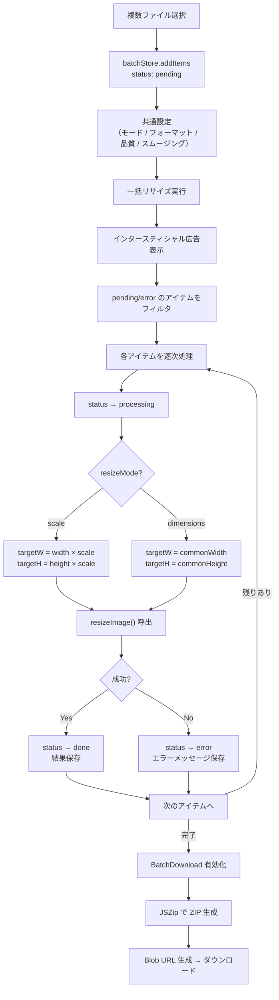
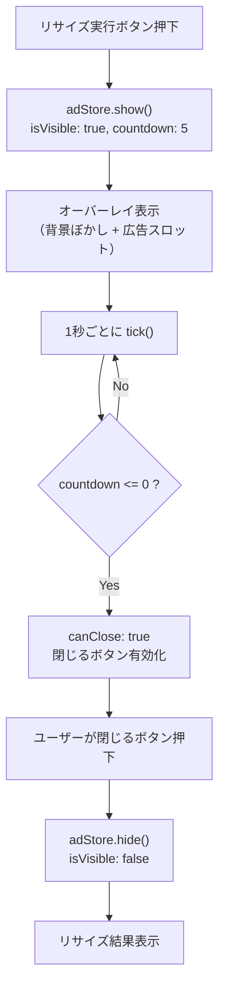

# PixelForge 基本設計書

| 項目 | 内容 |
| --- | --- |
| プロジェクト名 | PixelForge |
| バージョン | 0.1.0 |
| 作成日 | 2026-03-22 |
| 本番URL | https://pixelforge.me |

---

## 1. システム概要

PixelForge は、ブラウザ上で完結する画像リサイズ Web アプリケーションである。サーバーへの画像アップロードは一切行わず、すべての画像処理をクライアントサイドの Canvas API で実行する。これによりユーザーのプライバシーを保護しつつ、高速なリサイズ処理を実現する。

### 1.1 主要機能

- 単一画像リサイズ（アスペクト比ロック、スケールプリセット、SNSプリセット、カスタムプリセット）
- 一括リサイズ（最大20枚、ZIP一括ダウンロード）
- 出力フォーマット選択（PNG / JPEG / WebP）
- 品質調整（0.0〜1.0）
- スムージング ON/OFF（ピクセルアートモード対応）
- 4倍以上拡大時のマルチステップリサイズによる品質向上
- ダークモード対応
- キーボードショートカット（Enter でリサイズ、Ctrl+S でダウンロード）
- リサイズ前後の比較スライダー

### 1.2 システムアーキテクチャ概要



> **重要**: 画像データはサーバーに一切送信されない。すべての処理はブラウザ内で完結する。

---

## 2. 技術スタック

### 2.1 本番依存パッケージ

| パッケージ | バージョン | 用途 |
| --- | --- | --- |
| next | 16.2.0 | フレームワーク（App Router） |
| react | 19.2.4 | UIライブラリ |
| react-dom | 19.2.4 | React DOM レンダリング |
| zustand | ^5.0.12 | 軽量グローバル状態管理 |
| framer-motion | ^12.38.0 | アニメーション（画面遷移、オーバーレイ） |
| next-themes | ^0.4.6 | ダークモード切り替え |
| jszip | ^3.10.1 | ZIP ファイル生成（一括ダウンロード） |
| lucide-react | ^0.577.0 | アイコンコンポーネント |
| react-compare-slider | ^3.1.0 | リサイズ前後の比較スライダー |

### 2.2 開発依存パッケージ

| パッケージ | バージョン | 用途 |
| --- | --- | --- |
| typescript | ^5 | 型安全な開発 |
| tailwindcss | ^4 | ユーティリティファーストCSS |
| @tailwindcss/postcss | ^4 | Tailwind CSS PostCSS プラグイン |
| eslint | ^9 | 静的解析 |
| eslint-config-next | 16.2.0 | Next.js 向け ESLint 設定 |
| @types/node | ^20 | Node.js 型定義 |
| @types/react | ^19 | React 型定義 |
| @types/react-dom | ^19 | React DOM 型定義 |

### 2.3 デプロイ環境

| 項目 | 内容 |
| --- | --- |
| ホスティング | Vercel |
| リージョン | hnd1（東京） |
| フレームワーク設定 | Next.js |
| ドメイン | pixelforge.me |

---

## 3. アーキテクチャ設計

### 3.1 レイヤー構造



各レイヤーの責務は以下の通りである。

| レイヤー | 責務 |
| --- | --- |
| **Pages** | ルーティング単位のページコンポーネント。フック・コンポーネントの組み合わせ |
| **Components** | 表示・入力を担う再利用可能なUIコンポーネント |
| **Hooks** | ビジネスロジックをカプセル化するカスタムフック |
| **Lib** | フレームワーク非依存の純粋関数・ユーティリティ |
| **Stores** | Zustand によるグローバル状態管理 |
| **Types** | アプリケーション全体で共有する TypeScript 型定義 |

### 3.2 ディレクトリ構造

```
src/
├── app/                          # Next.js App Router ページ
│   ├── layout.tsx                # ルートレイアウト（メタデータ、フォント、Providers、AdScript）
│   ├── providers.tsx             # ThemeProvider（next-themes）
│   ├── page.tsx                  # トップページ（単一リサイズ）
│   ├── batch/
│   │   └── page.tsx              # 一括リサイズページ
│   └── globals.css               # グローバルスタイル
│
├── components/                   # UIコンポーネント
│   ├── ad/                       # 広告関連
│   │   ├── AdScript.tsx          #   AdSense スクリプト読み込み
│   │   ├── AdSlot.tsx            #   広告枠コンポーネント
│   │   └── InterstitialOverlay.tsx #  インタースティシャル広告オーバーレイ
│   ├── batch/                    # 一括処理関連
│   │   ├── BatchUploader.tsx     #   複数ファイルアップロード
│   │   ├── BatchList.tsx         #   バッチアイテム一覧・リサイズ実行
│   │   ├── BatchItem.tsx         #   個別アイテム表示
│   │   └── BatchDownload.tsx     #   ZIP一括ダウンロードボタン
│   ├── layout/                   # レイアウト共通
│   │   ├── Header.tsx            #   ヘッダー（ナビゲーション、クリアボタン）
│   │   └── Footer.tsx            #   フッター
│   ├── preview/                  # プレビュー・結果表示
│   │   ├── PreviewPanel.tsx      #   プレビューパネル統括
│   │   ├── ImagePreview.tsx      #   画像プレビュー表示
│   │   ├── CompareSlider.tsx     #   リサイズ前後比較スライダー
│   │   ├── ImageInfo.tsx         #   画像メタ情報表示
│   │   └── DownloadButton.tsx    #   ダウンロードボタン
│   ├── resize/                   # リサイズ設定
│   │   ├── SettingsPanel.tsx     #   設定パネル統括
│   │   ├── DimensionInput.tsx    #   幅・高さ入力
│   │   ├── ResizeModeToggle.tsx  #   リサイズモード切替
│   │   ├── ScalePresets.tsx      #   スケールプリセットボタン群
│   │   ├── SnsPresets.tsx        #   SNSプリセットボタン群
│   │   ├── CustomPresets.tsx     #   カスタムプリセット管理
│   │   ├── FormatSelect.tsx      #   出力フォーマット選択
│   │   ├── QualitySlider.tsx     #   品質スライダー
│   │   ├── ResizeButton.tsx      #   リサイズ実行ボタン
│   │   └── CanvasWarning.tsx     #   Canvas サイズ制限警告
│   └── upload/                   # アップロード
│       └── DropZone.tsx          #   ドラッグ&ドロップ／ファイル選択エリア
│
├── hooks/                        # カスタムフック
│   ├── useFileUpload.ts          # ファイル読み込み・バリデーション
│   ├── useAspectRatio.ts         # アスペクト比計算・ロック制御
│   ├── useCanvasResize.ts        # Canvas リサイズ処理（単一、マルチステップ分岐）
│   ├── useBatchResize.ts         # 一括リサイズ処理
│   ├── useDownload.ts            # ダウンロード処理
│   ├── useCustomPresets.ts       # カスタムプリセット CRUD（localStorage）
│   └── useImageInfo.ts           # 画像情報取得
│
├── lib/                          # ユーティリティ・純粋関数
│   ├── canvas/
│   │   ├── resize.ts             # Canvas API による画像リサイズ実装
│   │   └── multi-step.ts         # マルチステップリサイズ（4倍以上拡大時）
│   ├── canvas-limits.ts          # ブラウザ Canvas サイズ上限検出
│   ├── constants.ts              # 定数定義（対応MIME、拡張子、最大ファイル数）
│   ├── file-utils.ts             # ファイル名生成、フォーマット変換、バリデーション
│   └── presets.ts                # スケール・SNSプリセット定義
│
├── stores/                       # Zustand ストア
│   ├── resizeStore.ts            # 単一リサイズ状態（フォーマット、品質、結果）
│   ├── batchStore.ts             # 一括リサイズ状態（アイテム一覧、共通設定）
│   └── adStore.ts                # 広告表示状態（表示/非表示、カウントダウン）
│
└── types/                        # 型定義
    ├── index.ts                  # 共有型（ImageFormat, ResizeOptions, BatchItem 等）
    └── adsense.d.ts              # Google AdSense 型宣言
```

### 3.3 Zustand ストア設計

#### resizeStore（単一リサイズ）

| ステート | 型 | 説明 |
| --- | --- | --- |
| `format` | `ImageFormat` | 出力フォーマット（デフォルト: `image/png`） |
| `quality` | `number` | 品質 0.0〜1.0（デフォルト: 0.9、PNG時は1） |
| `smoothing` | `boolean` | スムージング有効/無効（デフォルト: true） |
| `isProcessing` | `boolean` | リサイズ処理中フラグ |
| `resizedDataUrl` | `string \| null` | リサイズ結果 Data URL |
| `resizedFileSize` | `number \| null` | リサイズ結果ファイルサイズ（バイト） |

#### batchStore（一括リサイズ）

| ステート | 型 | 説明 |
| --- | --- | --- |
| `items` | `BatchItem[]` | アップロードされた画像アイテム一覧 |
| `resizeMode` | `"scale" \| "dimensions"` | リサイズモード（倍率 or 固定サイズ） |
| `commonFormat` | `ImageFormat` | 共通出力フォーマット |
| `commonQuality` | `number` | 共通品質設定 |
| `commonSmoothing` | `boolean` | 共通スムージング設定 |
| `commonScale` | `number` | 共通倍率（scaleモード時） |
| `commonWidth` | `number` | 共通幅（dimensionsモード時、デフォルト: 1080） |
| `commonHeight` | `number` | 共通高さ（dimensionsモード時、デフォルト: 1080） |
| `isProcessing` | `boolean` | 処理中フラグ |

#### adStore（広告制御）

| ステート | 型 | 説明 |
| --- | --- | --- |
| `isVisible` | `boolean` | オーバーレイ表示中フラグ |
| `countdown` | `number` | 閉じるまでのカウントダウン秒数（初期値: 5） |
| `canClose` | `boolean` | 閉じるボタン有効フラグ |

---

## 4. データフロー概要

### 4.1 単一画像リサイズ データフロー



### 4.2 一括リサイズ データフロー



---

## 5. 画面遷移設計

### 5.1 画面一覧

| パス | ページ名 | 説明 |
| --- | --- | --- |
| `/` | 単一リサイズページ | メインの画像リサイズ画面 |
| `/batch` | 一括リサイズページ | 複数画像の一括リサイズ画面 |

### 5.2 画面遷移図



### 5.3 状態遷移の詳細

#### トップページ（`/`）

1. **未アップロード状態**: `DropZone` が表示される。ファイル選択ダイアログまたはドラッグ&ドロップで画像を読み込む。
2. **エディター状態**: 画像読み込み後、左側に `SettingsPanel`（リサイズ設定）、右側に `PreviewPanel`（プレビュー）が表示される。`AnimatePresence` によるフェードアニメーションで遷移する。
3. **リサイズ結果状態**: リサイズ実行後、プレビューパネルに結果画像と比較スライダーが表示され、ダウンロードが可能になる。

#### 一括リサイズページ（`/batch`）

1. **未アップロード状態**: `BatchUploader` が表示される。
2. **一覧表示状態**: ファイル追加後、`BatchList` にアイテムが一覧表示される。共通リサイズ設定（倍率 or 固定サイズ、フォーマット、品質）を指定可能。
3. **処理完了状態**: 一括リサイズ完了後、`BatchDownload` ボタンが有効になり、ZIP でダウンロード可能。

---

## 6. 処理フロー設計

### 6.1 単一画像リサイズフロー



### 6.2 マルチステップリサイズフロー

4倍以上の拡大時に段階的にリサイズすることで、Canvas の補間品質を最大限活用する。



### 6.3 一括リサイズフロー



### 6.4 インタースティシャル広告表示フロー



---

## 7. 外部連携

### 7.1 Google AdSense

| 項目 | 内容 |
| --- | --- |
| 読み込み方式 | `next/script`（`strategy: "lazyOnload"`） |
| クライアントID | 環境変数 `NEXT_PUBLIC_ADSENSE_CLIENT` |
| 広告表示箇所 | インタースティシャルオーバーレイ（`InterstitialOverlay` 内の `AdSlot`） |
| 表示タイミング | リサイズ実行時（単一・一括共通） |
| 閉じるまでの待機 | 5秒カウントダウン後に閉じるボタンが有効化 |
| ads.txt | `/public/ads.txt` に配置 |

### 7.2 next-themes

| 項目 | 内容 |
| --- | --- |
| テーマ属性 | `class`（Tailwind CSS のダークモードと連携） |
| デフォルトテーマ | `system`（OS設定に追従） |
| 設定箇所 | `src/app/providers.tsx` の `ThemeProvider` |

### 7.3 JSZip

| 項目 | 内容 |
| --- | --- |
| 用途 | 一括リサイズ結果を ZIP ファイルとしてまとめてダウンロード |
| 使用箇所 | `src/components/batch/BatchDownload.tsx` |
| 出力ファイル名 | `pixelforge_batch_{timestamp}.zip` |
| ZIP内ファイル名 | `{元ファイル名}_{幅}x{高さ}.{拡張子}` |

---

## 8. 制約事項・前提条件

### 8.1 ブラウザ要件

- Canvas API をサポートするモダンブラウザが必須（Chrome, Firefox, Safari, Edge の最新版を想定）
- JavaScript が有効であること
- File API / FileReader API / Blob API が利用可能であること

### 8.2 Canvas サイズ制限

- ブラウザごとに Canvas の最大サイズが異なる（16384px, 11180px, 8192px, 4096px）
- `canvas-limits.ts` で実行時にブラウザの上限を自動検出し、超過時に `CanvasWarning` コンポーネントで警告を表示する
- 検出結果はメモリ内にキャッシュされ、再検出を防ぐ

### 8.3 対応画像フォーマット

| 操作 | 対応フォーマット |
| --- | --- |
| 入力（読み込み） | JPEG, PNG, WebP, BMP, GIF, SVG |
| 出力（書き出し） | JPEG, PNG, WebP |

### 8.4 一括処理の上限

- 一度にアップロード可能なファイル数: **最大20枚**（`MAX_BATCH_FILES = 20`）
- 一括リサイズは逐次処理（並列処理ではない）のため、ファイル数に比例して処理時間が増加する

### 8.5 データ永続化

- 画像データはメモリ上（React state / Zustand store）にのみ保持され、永続化されない
- カスタムプリセットのみ `localStorage`（キー: `pixelforge-custom-presets`）に JSON 形式で保存される
- ページリロード時、画像データおよびリサイズ結果はすべて失われる

### 8.6 セキュリティヘッダー

`next.config.ts` で以下のレスポンスヘッダーが全ページに付与される。

| ヘッダー | 値 |
| --- | --- |
| `X-Content-Type-Options` | `nosniff` |
| `X-Frame-Options` | `DENY` |
| `Referrer-Policy` | `strict-origin-when-cross-origin` |

### 8.7 画像最適化

- Next.js の画像最適化機能は無効化されている（`images.unoptimized: true`）
- すべての画像処理はクライアントサイドの Canvas API で行うため、サーバーサイドの画像最適化は不要

### 8.8 SEO 対応

- JSON-LD 構造化データ（`WebApplication` スキーマ）をルートレイアウトに埋め込み
- OpenGraph / Twitter Card メタデータを設定
- `lang="ja"` を html 要素に指定
- `<h1>` は `sr-only`（スクリーンリーダー専用）で設定
