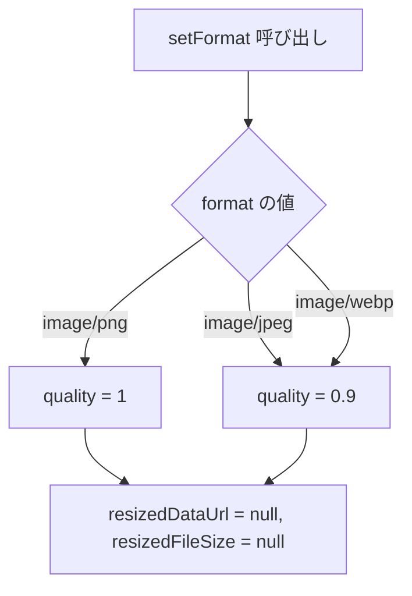
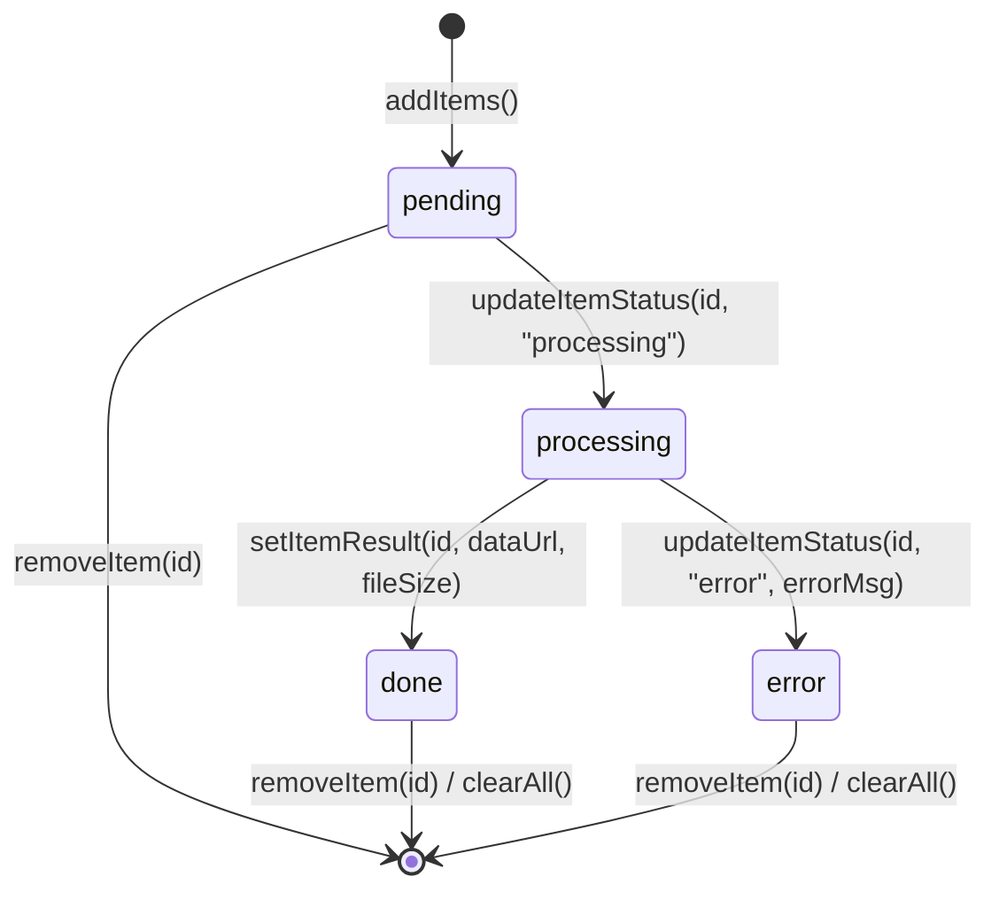
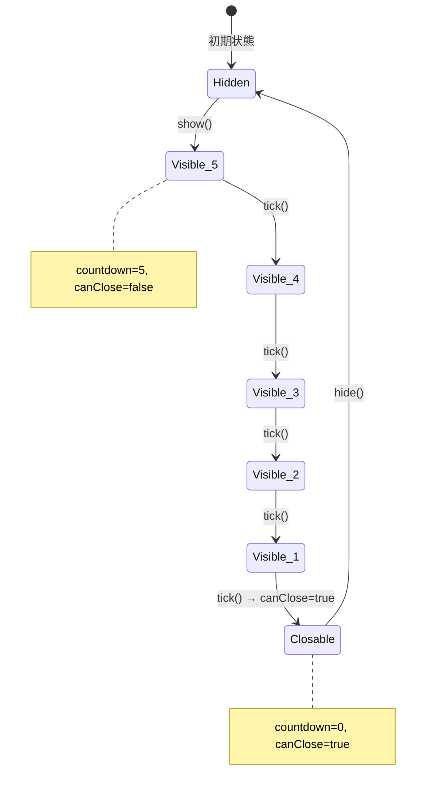
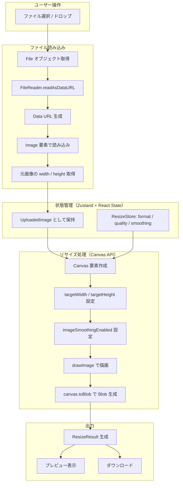
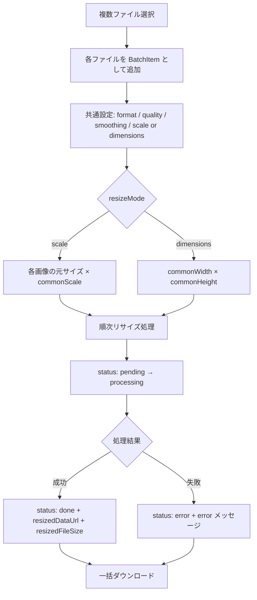
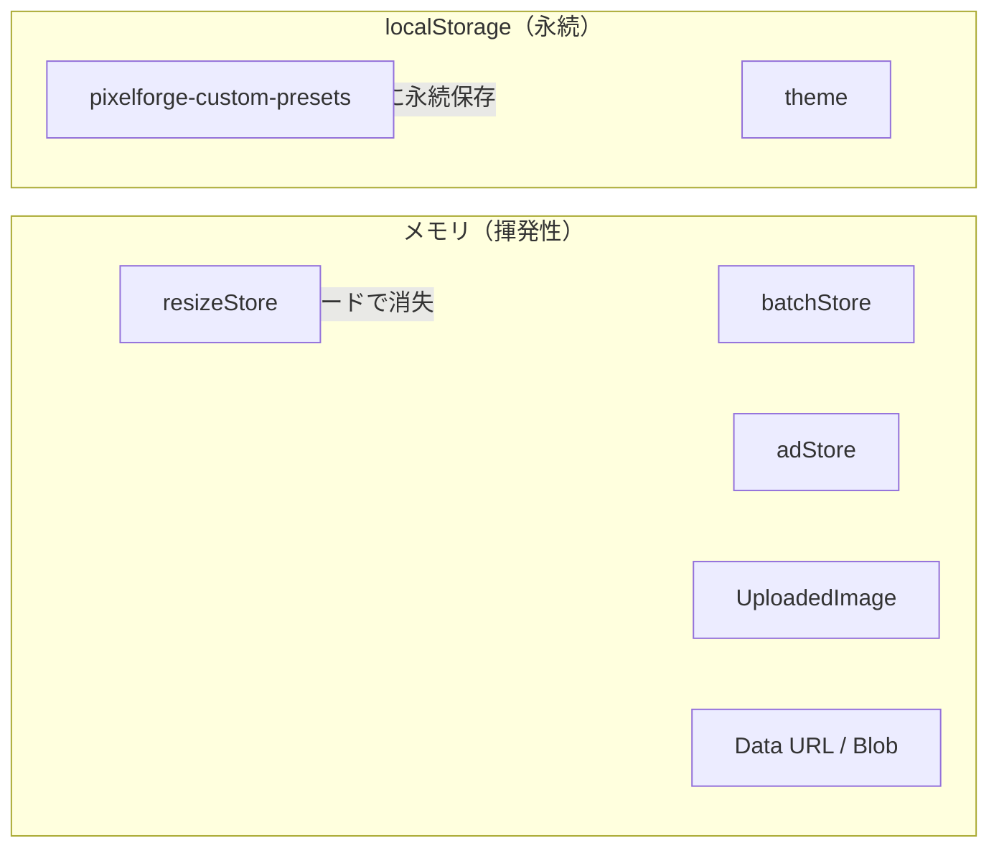
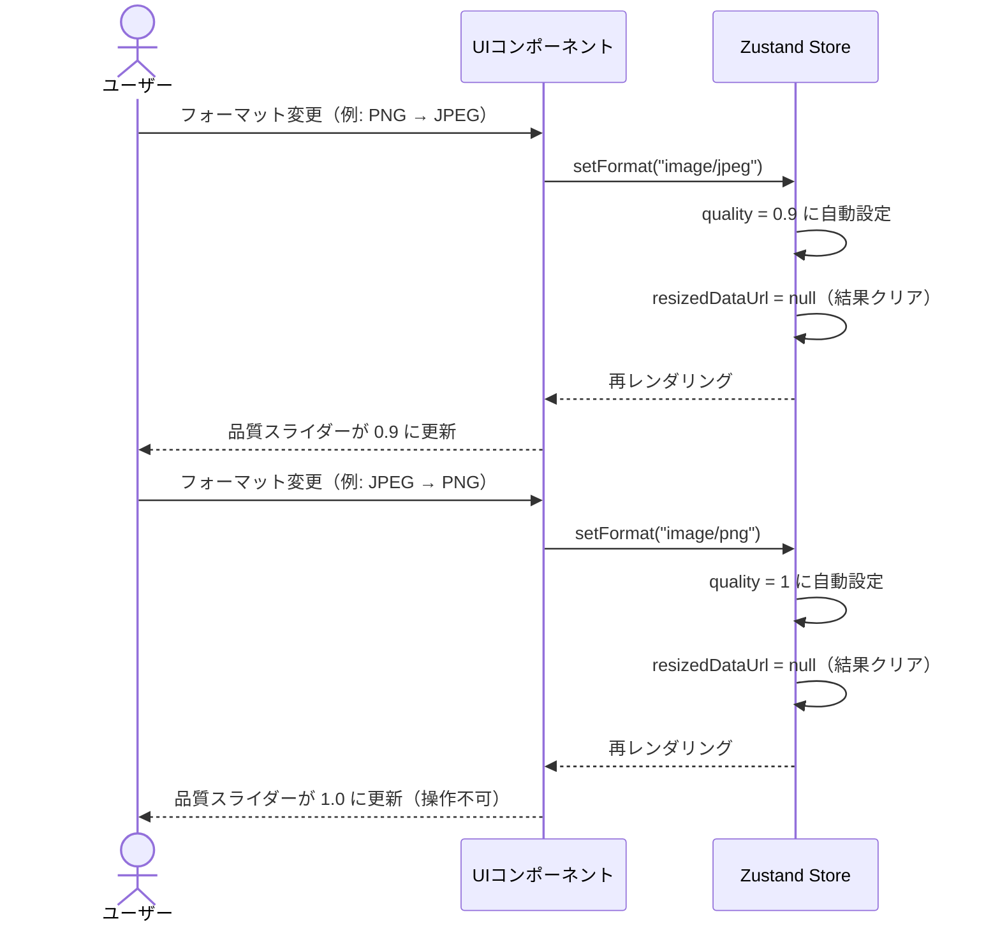

# PixelForge データ設計書

| 項目 | 内容 |
|------|------|
| プロジェクト名 | PixelForge |
| 技術スタック | Next.js 16 / React 19 / TypeScript / Zustand / Canvas API |
| 作成日 | 2026-03-22 |

---

## 目次

1. [型定義一覧](#1-型定義一覧)
2. [Zustand ストア設計](#2-zustand-ストア設計)
3. [localStorage 設計](#3-localstorage-設計)
4. [定数定義](#4-定数定義)
5. [データフロー図](#5-データフロー図)

---

## 1. 型定義一覧

すべての型定義は `src/types/index.ts` に集約されている。

### 1.1 `ImageFormat`

出力画像フォーマットを表すユニオン型。

```typescript
type ImageFormat = "image/jpeg" | "image/png" | "image/webp";
```

| 値 | 説明 |
|----|------|
| `"image/jpeg"` | JPEG 形式。非可逆圧縮、品質指定可能 |
| `"image/png"` | PNG 形式。可逆圧縮、品質は常に 1（Canvas API の仕様） |
| `"image/webp"` | WebP 形式。非可逆圧縮、品質指定可能 |

### 1.2 `ResizeOptions`

リサイズ処理に渡すパラメータ。

```typescript
interface ResizeOptions {
  imageSrc: string;
  targetWidth: number;
  targetHeight: number;
  format: ImageFormat;
  quality: number;
  smoothing: boolean;
}
```

| フィールド | 型 | 説明 |
|------------|------|------|
| `imageSrc` | `string` | リサイズ元画像の Data URL |
| `targetWidth` | `number` | 出力幅（px） |
| `targetHeight` | `number` | 出力高さ（px） |
| `format` | `ImageFormat` | 出力フォーマット |
| `quality` | `number` | 品質（0.0 〜 1.0） |
| `smoothing` | `boolean` | `false` でピクセルアートモード（`imageSmoothingEnabled = false`） |

### 1.3 `ResizeResult`

リサイズ処理の出力。

```typescript
interface ResizeResult {
  dataUrl: string;
  width: number;
  height: number;
  blob: Blob;
  fileSize: number;
}
```

| フィールド | 型 | 説明 |
|------------|------|------|
| `dataUrl` | `string` | リサイズ後画像の Data URL（プレビュー・ダウンロード用） |
| `width` | `number` | 実際の出力幅（px） |
| `height` | `number` | 実際の出力高さ（px） |
| `blob` | `Blob` | リサイズ後画像の Blob オブジェクト |
| `fileSize` | `number` | ファイルサイズ（バイト） |

### 1.4 `UploadedImage`

アップロードされた元画像の情報。

```typescript
interface UploadedImage {
  file: File;
  src: string;
  width: number;
  height: number;
}
```

| フィールド | 型 | 説明 |
|------------|------|------|
| `file` | `File` | 元ファイルオブジェクト |
| `src` | `string` | FileReader で取得した Data URL |
| `width` | `number` | 元画像の幅（px） |
| `height` | `number` | 元画像の高さ（px） |

### 1.5 `ScalePreset`

倍率プリセット。

```typescript
interface ScalePreset {
  label: string;
  scale: number;
}
```

| フィールド | 型 | 説明 |
|------------|------|------|
| `label` | `string` | UI 表示ラベル（例: `"2x"`） |
| `scale` | `number` | 倍率（例: `2`） |

### 1.6 `SnsPreset`

SNS 向けサイズプリセット。

```typescript
interface SnsPreset {
  label: string;
  platform: string;
  width: number;
  height: number;
}
```

| フィールド | 型 | 説明 |
|------------|------|------|
| `label` | `string` | 用途ラベル（例: `"投稿"`, `"ストーリー"`） |
| `platform` | `string` | プラットフォーム名（例: `"Instagram"`, `"X/Twitter"`） |
| `width` | `number` | 推奨幅（px） |
| `height` | `number` | 推奨高さ（px） |

### 1.7 `BatchItemStatus`

一括処理における各アイテムの処理状態。

```typescript
type BatchItemStatus = "pending" | "processing" | "done" | "error";
```

| 値 | 説明 |
|----|------|
| `"pending"` | 処理待ち |
| `"processing"` | 処理中 |
| `"done"` | 処理完了 |
| `"error"` | エラー発生 |

### 1.8 `BatchItem`

一括処理の各画像アイテム。

```typescript
interface BatchItem {
  id: string;
  file: File;
  src: string;
  width: number;
  height: number;
  status: BatchItemStatus;
  resizedDataUrl: string | null;
  resizedFileSize: number | null;
  error: string | null;
}
```

| フィールド | 型 | 説明 |
|------------|------|------|
| `id` | `string` | 一意な識別子 |
| `file` | `File` | 元ファイルオブジェクト |
| `src` | `string` | Data URL |
| `width` | `number` | 元画像の幅（px） |
| `height` | `number` | 元画像の高さ（px） |
| `status` | `BatchItemStatus` | 処理状態 |
| `resizedDataUrl` | `string \| null` | リサイズ後の Data URL（処理前は `null`） |
| `resizedFileSize` | `number \| null` | リサイズ後のファイルサイズ（処理前は `null`） |
| `error` | `string \| null` | エラーメッセージ（正常時は `null`） |

### 1.9 `CustomPreset`

ユーザー定義のカスタムプリセット。

```typescript
interface CustomPreset {
  id: string;
  name: string;
  width: number;
  height: number;
}
```

| フィールド | 型 | 説明 |
|------------|------|------|
| `id` | `string` | 一意な識別子（`Date.now()` + ランダム文字列で生成） |
| `name` | `string` | プリセット名 |
| `width` | `number` | 幅（px） |
| `height` | `number` | 高さ（px） |

### 1.10 `BatchResizeMode`

一括処理のリサイズモード（`batchStore.ts` で定義）。

```typescript
type BatchResizeMode = "scale" | "dimensions";
```

| 値 | 説明 |
|----|------|
| `"scale"` | 倍率指定モード |
| `"dimensions"` | 幅・高さ指定モード |

---

## 2. Zustand ストア設計

本アプリケーションでは 3 つの Zustand ストアでクライアント状態を管理する。いずれもサーバーサイドとの同期やミドルウェア（persist 等）は使用しない、純粋なインメモリストアである。

### 2.1 `useResizeStore`（単一画像リサイズ）

**ファイル:** `src/stores/resizeStore.ts`

#### ステートフィールド

| フィールド | 型 | 初期値 | 説明 |
|------------|------|--------|------|
| `format` | `ImageFormat` | `"image/png"` | 出力フォーマット |
| `quality` | `number` | `0.9` | 出力品質（0.0〜1.0） |
| `smoothing` | `boolean` | `true` | スムージング有効/無効 |
| `isProcessing` | `boolean` | `false` | リサイズ処理中フラグ |
| `resizedDataUrl` | `string \| null` | `null` | リサイズ結果の Data URL |
| `resizedFileSize` | `number \| null` | `null` | リサイズ結果のファイルサイズ |

#### アクション

| アクション | シグネチャ | 説明 |
|-----------|-----------|------|
| `setFormat` | `(format: ImageFormat) => void` | フォーマット変更。**副作用:** PNG 選択時は品質を `1` に、それ以外は `0.9` に自動調整。結果もクリアする |
| `setQuality` | `(quality: number) => void` | 品質のみ変更 |
| `setSmoothing` | `(smoothing: boolean) => void` | スムージング切替 |
| `setProcessing` | `(isProcessing: boolean) => void` | 処理中フラグ切替 |
| `setResult` | `(dataUrl: string, fileSize: number) => void` | リサイズ結果をセットし、`isProcessing` を `false` に戻す |
| `clearResult` | `() => void` | リサイズ結果のみクリア |
| `resetAll` | `() => void` | すべてのステートを初期値にリセット |

#### 状態遷移ロジック — フォーマット変更時の品質自動調整



> PNG は Canvas API の `toDataURL` / `toBlob` で品質パラメータが無視されるため、常に `1` を設定する。

### 2.2 `useBatchStore`（一括処理）

**ファイル:** `src/stores/batchStore.ts`

#### ステートフィールド

| フィールド | 型 | 初期値 | 説明 |
|------------|------|--------|------|
| `items` | `BatchItem[]` | `[]` | 一括処理対象の画像リスト |
| `resizeMode` | `BatchResizeMode` | `"scale"` | リサイズモード |
| `commonFormat` | `ImageFormat` | `"image/png"` | 全画像共通の出力フォーマット |
| `commonQuality` | `number` | `0.9` | 全画像共通の品質 |
| `commonSmoothing` | `boolean` | `true` | 全画像共通のスムージング |
| `commonScale` | `number` | `1` | 倍率モード時の倍率 |
| `commonWidth` | `number` | `1080` | 寸法モード時の幅 |
| `commonHeight` | `number` | `1080` | 寸法モード時の高さ |
| `isProcessing` | `boolean` | `false` | 一括処理中フラグ |

#### アクション

| アクション | シグネチャ | 説明 |
|-----------|-----------|------|
| `addItems` | `(items: Omit<BatchItem, "status" \| "resizedDataUrl" \| "resizedFileSize" \| "error">[]) => void` | アイテム追加。`status: "pending"`, 結果フィールドは `null` で初期化 |
| `removeItem` | `(id: string) => void` | 指定 ID のアイテムを削除 |
| `clearAll` | `() => void` | 全アイテム削除、`isProcessing` を `false` にリセット |
| `updateItemStatus` | `(id: string, status: BatchItemStatus, error?: string) => void` | 個別アイテムのステータス更新 |
| `setItemResult` | `(id: string, dataUrl: string, fileSize: number) => void` | 個別アイテムの処理結果をセット（`status` を `"done"` に変更） |
| `setCommonFormat` | `(format: ImageFormat) => void` | 共通フォーマット変更。**副作用:** PNG 時は品質 `1`、それ以外は `0.9` |
| `setCommonQuality` | `(quality: number) => void` | 共通品質変更 |
| `setCommonSmoothing` | `(smoothing: boolean) => void` | 共通スムージング切替 |
| `setCommonScale` | `(scale: number) => void` | 共通倍率変更 |
| `setResizeMode` | `(mode: BatchResizeMode) => void` | リサイズモード切替 |
| `setCommonWidth` | `(width: number) => void` | 共通幅変更 |
| `setCommonHeight` | `(height: number) => void` | 共通高さ変更 |
| `setProcessing` | `(isProcessing: boolean) => void` | 処理中フラグ切替 |

#### BatchItem の状態遷移



### 2.3 `useAdStore`（インタースティシャル広告）

**ファイル:** `src/stores/adStore.ts`

#### ステートフィールド

| フィールド | 型 | 初期値 | 説明 |
|------------|------|--------|------|
| `isVisible` | `boolean` | `false` | 広告表示中フラグ |
| `countdown` | `number` | `5` | 閉じるまでのカウントダウン（秒） |
| `canClose` | `boolean` | `false` | 閉じるボタン有効フラグ |

#### アクション

| アクション | シグネチャ | 説明 |
|-----------|-----------|------|
| `show` | `() => void` | 広告を表示。`countdown` を `5` にリセット、`canClose` を `false` に |
| `hide` | `() => void` | 広告を非表示に |
| `tick` | `() => void` | カウントダウンを 1 減算。`0` 以下になったら `canClose = true` |

#### 広告カウントダウンの状態遷移



---

## 3. localStorage 設計

本アプリケーションが使用する localStorage のキーとスキーマを以下に示す。

### 3.1 カスタムプリセット

**管理元:** `src/hooks/useCustomPresets.ts`

| 項目 | 値 |
|------|------|
| キー | `pixelforge-custom-presets` |
| 型 | `CustomPreset[]`（JSON 文字列として格納） |
| デフォルト | `[]`（空配列） |

#### 格納スキーマ

```json
[
  {
    "id": "1711100000000-a1b2c3d",
    "name": "ブログサムネイル",
    "width": 800,
    "height": 450
  },
  {
    "id": "1711100001000-x9y8z7w",
    "name": "アイコン",
    "width": 256,
    "height": 256
  }
]
```

#### ID 生成ルール

```
`${Date.now()}-${Math.random().toString(36).slice(2, 9)}`
```

タイムスタンプ + 7 文字のランダム英数字で一意性を確保。

#### 操作

| 操作 | 関数 | 説明 |
|------|------|------|
| 読み込み | `loadPresets()` | `localStorage.getItem` → `JSON.parse`。SSR 時やパースエラー時は `[]` を返す |
| 保存 | `savePresets(presets)` | `JSON.stringify` → `localStorage.setItem` |
| 追加 | `addPreset(name, width, height)` | 新規プリセットを末尾に追加して保存 |
| 削除 | `removePreset(id)` | 指定 ID をフィルタリングで除外して保存 |

### 3.2 テーマ設定（next-themes）

| 項目 | 値 |
|------|------|
| キー | `theme` |
| 型 | `string` |
| 取りうる値 | `"light"`, `"dark"`, `"system"` |
| デフォルト | `"system"` |
| 管理元 | `next-themes` ライブラリ（自動管理） |

### 3.3 localStorage 使用一覧

| キー | 用途 | 管理元 | 永続化 |
|------|------|--------|--------|
| `pixelforge-custom-presets` | カスタムプリセット | `useCustomPresets` フック | あり |
| `theme` | ダーク/ライトテーマ | `next-themes` | あり |

> **注意:** Zustand ストア（resizeStore, batchStore, adStore）は `persist` ミドルウェアを使用しておらず、ページリロードでリセットされる。画像データ（Data URL）はメモリ上のみに保持される。

---

## 4. 定数定義

### 4.1 `src/lib/constants.ts`

#### `ACCEPTED_IMAGE_TYPES`

アップロード可能な MIME タイプの一覧（`as const` で読み取り専用）。

```typescript
const ACCEPTED_IMAGE_TYPES = [
  "image/jpeg",
  "image/png",
  "image/webp",
  "image/bmp",
  "image/gif",
  "image/svg+xml",
] as const;
```

> **補足:** 入力は 6 種類のフォーマットを受け付けるが、出力は `ImageFormat` 型で定義された 3 種類（JPEG / PNG / WebP）のみ。

#### `ACCEPTED_EXTENSIONS`

ファイル選択ダイアログの `accept` 属性に使用する拡張子文字列。

```typescript
const ACCEPTED_EXTENSIONS = ".jpg,.jpeg,.png,.webp,.bmp,.gif,.svg";
```

#### `MAX_BATCH_FILES`

一括処理で同時にアップロードできる最大ファイル数。

```typescript
const MAX_BATCH_FILES = 20;
```

#### `DEFAULT_QUALITY`

デフォルトの出力品質。

```typescript
const DEFAULT_QUALITY = 0.9;
```

### 4.2 `src/lib/presets.ts`

#### `SCALE_PRESETS`（倍率プリセット）

| ラベル | 倍率 |
|--------|------|
| `0.25x` | 0.25 |
| `0.5x` | 0.5 |
| `0.75x` | 0.75 |
| `1.5x` | 1.5 |
| `2x` | 2 |
| `3x` | 3 |
| `4x` | 4 |

#### `SNS_PRESETS`（SNS プリセット）

| プラットフォーム | ラベル | 幅 (px) | 高さ (px) |
|------------------|--------|---------|-----------|
| Instagram | 投稿 | 1080 | 1080 |
| Instagram | ストーリー | 1080 | 1920 |
| X/Twitter | 投稿 | 1200 | 675 |
| X/Twitter | ヘッダー | 1500 | 500 |
| Facebook | カバー | 820 | 312 |
| YouTube | サムネイル | 1280 | 720 |
| Web | OGP | 1200 | 630 |

---

## 5. データフロー図

### 5.1 単一画像リサイズの全体フロー



### 5.2 一括処理のフロー



### 5.3 データの保持場所と寿命



### 5.4 フォーマット変更時の品質連動

resizeStore と batchStore の両方で同じロジックが適用される。


