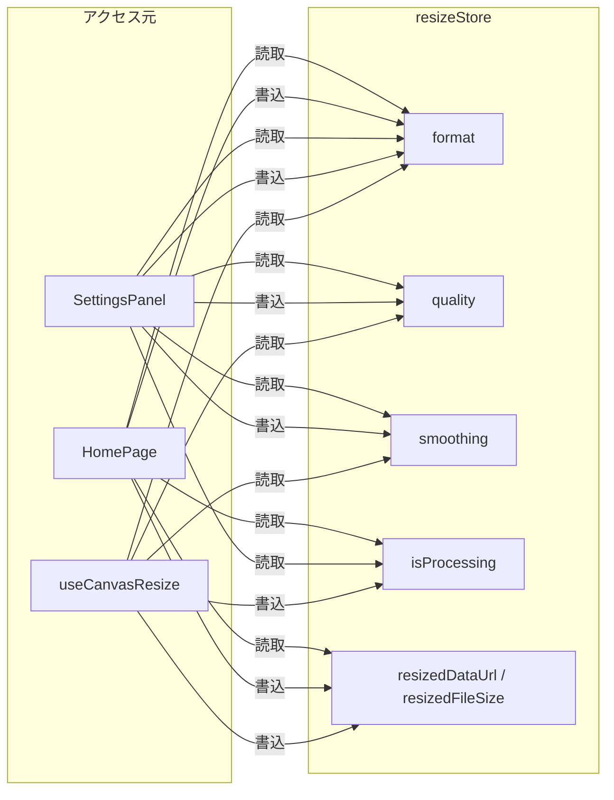
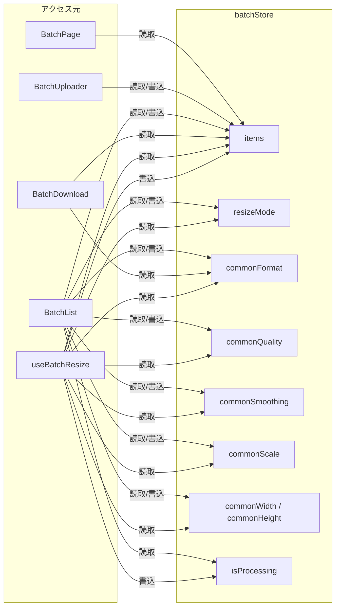
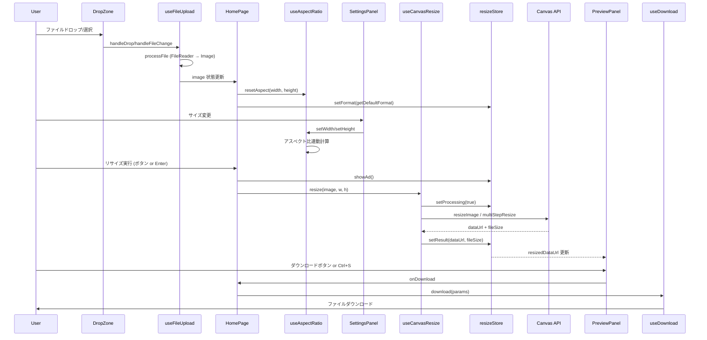

# PixelForge 詳細設計書

## 目次

1. [ページコンポーネント設計](#1-ページコンポーネント設計)
2. [コンポーネント設計](#2-コンポーネント設計)
3. [カスタムフック設計](#3-カスタムフック設計)
4. [ライブラリ関数設計](#4-ライブラリ関数設計)
5. [コンポーネント依存関係図](#5-コンポーネント依存関係図)

---

## 1. ページコンポーネント設計

### 1.1 HomePage (`src/app/page.tsx`)

#### 概要

単一画像リサイズ機能の全体を統括するページコンポーネント。`"use client"` ディレクティブによりクライアントサイドで動作する。4つのカスタムフックと2つのZustandストアを統合し、画像のアップロードからリサイズ・ダウンロードまでの全フローを制御する。

#### フック統合

| フック / ストア | 取得する値 | 役割 |
|---|---|---|
| `useFileUpload` | `image`, `fileInputRef`, `handleFileChange`, `handleDrop`, `handleDragOver`, `reset`, `openFileDialog` | ファイル入力と画像読み込み |
| `useAspectRatio` | `width`, `height`, `isLocked`, `setWidth`, `setHeight`, `toggleLock`, `applyScale`, `applyPreset`, `reset` | 寸法管理とアスペクト比制御 |
| `useCanvasResize` | `resize` | Canvas APIによるリサイズ実行 |
| `useDownload` | `download` | リサイズ済み画像のダウンロード |
| `useResizeStore` | `format`, `resizedDataUrl`, `resizedFileSize`, `isProcessing`, `setFormat`, `resetAll` | リサイズ設定とリサイズ結果の状態管理 |
| `useAdStore` | `show` | インタースティシャル広告の表示トリガー |

#### 状態管理フロー

```
画像未選択 (image === null)
  │
  ├─ DropZone表示
  │    └─ ファイル選択 or ドロップ → useFileUpload.processFile()
  │         └─ FileReader → Image → setImage({ file, src, width, height })
  │
  ▼
画像選択済 (image !== null)
  │
  ├─ useEffect: resetAspect(image.width, image.height)
  │   └─ アスペクト比を画像の元サイズで初期化、ロック状態をtrueに
  ├─ useEffect: setFormat(getDefaultFormat(image.file))
  │   └─ JPEG→JPEG, WebP→WebP, その他→PNG をデフォルトフォーマットに設定
  │
  ├─ SettingsPanel表示 (左カラム)
  │    └─ 幅/高さ変更 → useAspectRatio経由で連動計算
  │    └─ プリセット適用 → applyScale / applyPreset
  │    └─ フォーマット/品質変更 → useResizeStore
  │
  ├─ PreviewPanel表示 (右カラム)
  │    └─ リサイズ前: 元画像のプレビュー
  │    └─ リサイズ後: リサイズ済み画像 or 比較スライダー
  │
  ├─ handleResize実行
  │    ├─ showAd() → インタースティシャル広告表示
  │    └─ resize(image, width, height)
  │         ├─ scale > 4 → multiStepResize (段階的拡大)
  │         └─ scale <= 4 → resizeImage (単一ステップ)
  │         └─ setResult(dataUrl, fileSize) → resizedDataUrl更新
  │
  └─ handleDownload実行
       └─ download({ dataUrl, originalFileName, width, height, format })
            └─ <a>要素を動的生成 → click() → 自動ダウンロード
```

#### キーボードショートカット

`useEffect` でグローバルな `keydown` イベントリスナーを登録する。

| キー | 条件 | 動作 |
|---|---|---|
| `Enter` | `image` が存在し、`isProcessing` がfalse、`e.target` がINPUT要素でない | `handleResize()` を実行 |
| `Ctrl+S` / `Cmd+S` | `resizedDataUrl` が存在する | ブラウザのデフォルト保存を `preventDefault()` で抑止し、`handleDownload()` を実行 |

INPUT要素にフォーカス中のEnterキーは無視する。これにより、DimensionInputで数値入力中にEnterを押してもリサイズが誤発火しない。

#### レイアウト構成

```
<div> flex flex-col min-h-screen
  ├─ <Header>          sticky top-0 z-50
  ├─ <main> flex-1
  │    ├─ [image未選択] <AnimatePresence> → <DropZone>
  │    └─ [image選択済] <AnimatePresence> → <motion.div>
  │         └─ grid grid-cols-1 lg:grid-cols-12
  │              ├─ <aside> lg:col-span-4 xl:col-span-3 → <SettingsPanel>
  │              └─ <section> lg:col-span-8 xl:col-span-9 → <PreviewPanel>
  ├─ <Footer>
  └─ <InterstitialOverlay>
```

AnimatePresenceの `mode="wait"` により、DropZoneの退出アニメーションが完了してからエディタ画面の入場アニメーションが開始する。

#### クリア処理

`handleClear` は `resetUpload()` と `resetStore()` を呼び出す。`resetUpload()` は `image` を `null` にしファイル入力をリセットする。`resetStore()` はフォーマット・品質・スムージングをデフォルトに戻し、リサイズ結果をクリアする。これによりアプリケーション全体が初期状態に復帰する。

---

### 1.2 BatchPage (`src/app/batch/page.tsx`)

#### 概要

複数画像の一括リサイズ機能を提供するページコンポーネント。`useBatchStore` を中心に状態管理を行い、`useBatchResize` フックでリサイズ処理を実行する。

#### フック統合

| フック / ストア | 取得する値 | 役割 |
|---|---|---|
| `useBatchStore` | `items`, `clearAll` | バッチアイテムの管理 |
| `useBatchResize` | `resizeAll` | 全アイテムの一括リサイズ |
| `useAdStore` | `show` | 広告表示トリガー |

#### 状態管理フロー

```
初期状態 (items.length === 0)
  │
  ├─ BatchUploader表示
  │    └─ ファイル選択 / ドロップ
  │         ├─ isValidImageType でフィルタリング
  │         ├─ MAX_BATCH_FILES (20) との差分チェック
  │         └─ FileReader + Image で各ファイルを読み込み → addItems()
  │
  ▼
アイテム存在 (items.length > 0)
  │
  ├─ BatchUploader (追加アップロード可能)
  ├─ BatchList (設定 + アイテム一覧 + リサイズボタン)
  │    ├─ resizeMode切替: "scale" | "dimensions"
  │    ├─ 共通設定: format, quality, smoothing, scale/width/height
  │    └─ リサイズ実行ボタン → handleResizeAll
  │
  └─ BatchDownload (完了アイテムが1つ以上ある場合のみ表示)
       └─ ZIP生成 → ダウンロード
```

#### handleResizeAll の処理順序

1. `showAd()` でインタースティシャル広告を表示
2. `resizeAll()` でバッチリサイズを開始
   - pending / error 状態のアイテムのみを処理対象とする
   - 逐次処理（for...of ループ）で1枚ずつリサイズ
   - 各アイテムの状態を `processing` → `done` / `error` に遷移

#### レイアウト構成

```
<div> flex flex-col min-h-screen
  ├─ <Header>
  ├─ <main> flex-1
  │    └─ max-w-4xl mx-auto px-4 py-8 space-y-6
  │         ├─ <h1> + <p> (タイトルと説明)
  │         ├─ <BatchUploader>
  │         └─ [items.length > 0]
  │              ├─ <BatchList>
  │              └─ <BatchDownload>
  ├─ <Footer>
  └─ <InterstitialOverlay>
```

---

## 2. コンポーネント設計

### 2.1 レイアウトコンポーネント

#### Header (`src/components/layout/Header.tsx`)

**内部状態:**

| 状態 | 型 | 初期値 | 用途 |
|---|---|---|---|
| `mounted` | `boolean` | `false` | SSRハイドレーション不一致を防止。`useEffect` で `true` に設定し、テーマ切替ボタンの表示条件とする |
| `showHelp` | `boolean` | `false` | ヘルプパネルの表示/非表示 |

**内部ロジック:**

- `useTheme()` (next-themes) でテーマ切替を実現。`mounted` がfalseの間はテーマボタンを非表示にし、SSR時のハイドレーションミスマッチを回避する
- `usePathname()` で現在のパスを取得し、`/batch` なら「単一処理」へのリンク、それ以外なら「一括処理」へのリンクを表示する
- ヘルプパネルは外側クリックで閉じる: `mousedown` イベントで `helpRef.current.contains(e.target)` を判定
- ヘルプパネルは `Escape` キーで閉じる: `keydown` イベントリスナー
- 両イベントリスナーは `showHelp` が `true` の時のみ登録され、`false` に戻ると解除される（クリーンアップ関数による）

**子コンポーネント:**

- `Step` — ヘルプパネル内の手順表示用。icon, title, descを受け取る純粋な表示コンポーネント
- `Shortcut` — ショートカットキー表示用。keys, labelを受け取る純粋な表示コンポーネント

#### Footer (`src/components/layout/Footer.tsx`)

状態を持たない純粋な表示コンポーネント。プライバシーメッセージ（ブラウザ完結）とアプリ名を表示する。

---

### 2.2 アップロードコンポーネント

#### DropZone (`src/components/upload/DropZone.tsx`)

**内部状態:**

| 状態 | 型 | 初期値 | 用途 |
|---|---|---|---|
| `isDragging` | `boolean` | `false` | ドラッグ中のビジュアルフィードバック制御 |

**イベント処理の流れ:**

```
dragenter → setIsDragging(true)  → 青色ハイライト + ImagePlusアイコン表示
dragleave → setIsDragging(false) → 通常表示に復帰
dragover  → e.preventDefault()   → ドロップを受け付け可能にする
drop      → setIsDragging(false) + onDrop(e) → 親へファイル情報を委譲
click     → onOpenFileDialog()   → 隠しファイル入力をトリガー
```

**レンダリング判定ロジック:**

- `isDragging` が `true` のとき:
  - ボーダー色: `border-blue-500`
  - 背景: `bg-blue-50 dark:bg-blue-950/30`
  - スケール: `scale-[1.02]` (微拡大)
  - アイコン: `ImagePlus` (lucide)
  - テキスト: 「ここにドロップ」
- `isDragging` が `false` のとき:
  - ボーダー色: `border-gray-300`
  - アイコン: `Upload` (lucide)
  - テキスト: 「画像をアップロード」

**「ファイルを選択」ボタン:**

`e.stopPropagation()` を呼び出す。これにより、ボタンクリックが親div (`onOpenFileDialog`) に伝播するのを防ぎ、`openFileDialog` が二重呼び出しされることを防止する。

入場/退出アニメーションは `framer-motion` の `motion.div` で制御。`initial={{ opacity: 0, y: 20 }}`、`animate={{ opacity: 1, y: 0 }}`、`exit={{ opacity: 0, y: -20 }}` でフェードイン/スライドアップ効果を実現。

---

### 2.3 リサイズ設定コンポーネント

#### SettingsPanel (`src/components/resize/SettingsPanel.tsx`)

**役割:** リサイズに関する全設定UIを縦方向に配置するコンテナコンポーネント。

**内部ストア接続:**

`useResizeStore` から `format`, `quality`, `smoothing`, `isProcessing`, `setFormat`, `setQuality`, `setSmoothing` を取得する。`useCustomPresets` フックから `presets`, `addPreset`, `removePreset` を取得する。

**子コンポーネント配置順序と各責務:**

1. **DimensionInput** — 幅/高さ入力 + アスペクト比ロック
2. **ScalePresets** — 倍率プリセットボタン群
3. **SnsPresets** — SNSプリセットボタン群
4. **CustomPresets** — ユーザー定義プリセット
5. **FormatSelect** — 出力フォーマット選択 (PNG/JPEG/WebP)
6. **QualitySlider** — 品質スライダー (10%〜100%)
7. **ResizeModeToggle** — スムーズ / ドット絵モード切替
8. **CanvasWarning** — Canvas制限超過の警告表示
9. **ResizeButton** — リサイズ実行ボタン

`overflow-y-auto max-h-[calc(100vh-8rem)]` により、設定パネルが画面高さを超える場合はスクロール可能になる。

#### DimensionInput (`src/components/resize/DimensionInput.tsx`)

**入力バリデーションロジック:**

```typescript
handleChange(value, setter):
  value === "" → setter("") // 空文字を許容（入力途中の状態）
  parseInt(value) → NaN or <= 0 → 何もしない（不正値を無視）
  parseInt(value) → 正の整数 → setter(num)
```

入力値は `number | ""` のユニオン型で管理される。空文字列を許容することで、ユーザーが入力欄をクリアして新しい値を入力する操作を自然に行える。

アスペクト比ロック状態に応じたアイコン表示: `isLocked` が `true` なら `Lock`（青色）、`false` なら `Unlock`（灰色）。

#### ScalePresets (`src/components/resize/ScalePresets.tsx`)

`SCALE_PRESETS` 定数配列（0.25x, 0.5x, 0.75x, 1.5x, 2x, 3x, 4x）をグリッドレイアウト（4列）で表示する。ボタンクリック時に `onApply(preset.scale)` を呼び出し、親経由で `useAspectRatio.applyScale` に委譲する。

#### SnsPresets (`src/components/resize/SnsPresets.tsx`)

`SNS_PRESETS` 定数配列（Instagram投稿/ストーリー、X/Twitter投稿/ヘッダー、Facebookカバー、YouTubeサムネイル、WebOGP）を縦リストで表示する。各項目はプラットフォーム名+ラベルと、幅x高さの数値を左右に配置する。クリック時 `onApply(preset.width, preset.height)` で `useAspectRatio.applyPreset` に委譲する。

#### CustomPresets (`src/components/resize/CustomPresets.tsx`)

**内部状態:**

| 状態 | 型 | 初期値 | 用途 |
|---|---|---|---|
| `isAdding` | `boolean` | `false` | プリセット追加フォームの表示/非表示 |
| `name` | `string` | `""` | 新規プリセットの名前入力 |

**追加フローのロジック:**

```
handleAdd():
  name.trim() が空 → 何もしない
  currentWidth が number でない → 何もしない
  currentHeight が number でない → 何もしない
  → onAdd(name.trim(), currentWidth, currentHeight)
  → setName("") で入力をリセット
  → setIsAdding(false) でフォームを閉じる
```

追加フォームのテキスト入力で `Enter` キーを押すと `handleAdd()` が呼ばれる。

**表示の条件分岐:**

- プリセットが1つ以上 → プリセットリスト表示（各項目にBookmarkアイコン + 名前 + サイズ + 削除ボタン）
- プリセットが0で `isAdding` がfalse → ガイドテキスト表示
- `isAdding` がtrue → 追加フォーム表示

削除ボタンは `group-hover:opacity-100` で、通常時は `opacity-0` で非表示。ホバー時のみ表示される。

#### FormatSelect (`src/components/resize/FormatSelect.tsx`)

3つのフォーマット（PNG, JPEG, WebP）をトグルボタン群として表示する。選択中のフォーマットは `bg-blue-600 text-white` で強調表示される。

#### QualitySlider (`src/components/resize/QualitySlider.tsx`)

**内部ロジック:**

- range入力の値域は10〜100（整数）。UIでは `Math.round(quality * 100)` でパーセント表示
- `onChange` で `parseInt(e.target.value, 10) / 100` に変換して0.1〜1.0の小数としてコールバックに渡す
- `format === "image/png"` のとき `disabled` prop が `true` となり、`opacity-50` クラスが適用される。PNGは可逆圧縮のため品質パラメータが無意味であることを視覚的に示す

#### ResizeModeToggle (`src/components/resize/ResizeModeToggle.tsx`)

2つの排他的ボタンで構成される。

- **スムーズ** (`smoothing: true`): 通常の画像リサイズ。Canvas APIの `imageSmoothingEnabled = true` + `imageSmoothingQuality = "high"` を使用
- **ドット絵向け** (`smoothing: false`): ピクセルアート向け。`imageSmoothingEnabled = false` でニアレストネイバー補間を使用。選択時は紫色 (`bg-purple-600`) で視覚的に区別する

#### CanvasWarning (`src/components/resize/CanvasWarning.tsx`)

**内部状態:**

| 状態 | 型 | 初期値 | 用途 |
|---|---|---|---|
| `warning` | `string \| null` | `null` | 警告メッセージ |

**ロジック:**

```
useEffect([targetWidth, targetHeight]):
  どちらかが number でない → setWarning(null)
  checkCanvasLimits(targetWidth, targetHeight):
    valid: true → setWarning(null)
    valid: false → setWarning(result.message)
```

`warning` が `null` の場合は何もレンダリングしない（`return null`）。警告がある場合はアンバー色の警告バナーを表示する。

#### ResizeButton (`src/components/resize/ResizeButton.tsx`)

**無効化条件:** `isProcessing` が `true` **または** `disabled`（幅・高さが数値でない場合）が `true`

**表示の切替:**

- `isProcessing: true` → `Loader2` アイコン（回転アニメーション）+ 「処理中...」
- `isProcessing: false` → `Scaling` アイコン + 「リサイズ実行」

---

### 2.4 プレビューコンポーネント

#### PreviewPanel (`src/components/preview/PreviewPanel.tsx`)

**内部状態:**

| 状態 | 型 | 初期値 | 用途 |
|---|---|---|---|
| `viewMode` | `"preview" \| "compare"` | `"preview"` | 表示モード切替 |

**レンダリング判定:**

```
resizedSrc が存在する場合:
  → ビューモード切替ボタン表示 (プレビュー / 比較)
  → viewMode === "compare" → <CompareSlider> 表示
  → viewMode === "preview" → <ImagePreview src={resizedSrc}> 表示

resizedSrc が null の場合:
  → ビューモード切替ボタン非表示
  → <ImagePreview src={originalSrc}> 表示（元画像をそのまま表示）
```

**子コンポーネント:**

1. `ImagePreview` / `CompareSlider` — 画像表示
2. `ImageInfo` — ファイル情報（元サイズ、リサイズ後サイズ、倍率）
3. `DownloadButton` — ダウンロードボタン（`resizedSrc` がないとき `disabled`）

#### ImagePreview (`src/components/preview/ImagePreview.tsx`)

**チェッカーボード背景の実装:**

透過画像の透明部分を視認できるよう、CSSグラデーションで市松模様（チェッカーボード）を描画する。

- ライトモード用: `#e5e7eb`（gray-200相当）の45度グラデーション4枚を組み合わせ
- ダークモード用: `#374151`（gray-700相当）の同パターン
- `dark:hidden` と `hidden dark:block` で排他的に表示切替

画像は `max-w-full max-h-[50vh] object-contain` で、アスペクト比を維持したままビューポートの50%以内に収まるよう制約される。

#### CompareSlider (`src/components/preview/CompareSlider.tsx`)

`react-compare-slider` ライブラリの `ReactCompareSlider` と `ReactCompareSliderImage` を使用。左側に元画像、右側にリサイズ後画像を配置し、ドラッグ可能なスライダーで比較する。`max-h-[50vh]` で高さを制約する。

#### ImageInfo (`src/components/preview/ImageInfo.tsx`)

**倍率計算ロジック:**

```typescript
const tW = typeof targetWidth === "number" ? targetWidth : originalWidth;
const tH = typeof targetHeight === "number" ? targetHeight : originalHeight;
const scalePercent = Math.round(
  Math.max(tW / originalWidth, tH / originalHeight) * 100
);
```

幅と高さの倍率のうち大きい方を採用してパーセント表示する。`targetWidth` / `targetHeight` が空文字列（入力途中）の場合は元のサイズをフォールバックとして使用する。

ファイルサイズ表示には `formatFileSize()` を使用し、B/KB/MB単位で自動変換する。

#### DownloadButton (`src/components/preview/DownloadButton.tsx`)

状態を持たない表示コンポーネント。`disabled` が `true` のとき `bg-gray-300 dark:bg-gray-700 cursor-not-allowed` で無効化表示。有効時は `bg-green-600 hover:bg-green-700` の緑色ボタン。

---

### 2.5 バッチコンポーネント

#### BatchUploader (`src/components/batch/BatchUploader.tsx`)

**内部状態:**

| 状態 | 型 | 初期値 | 用途 |
|---|---|---|---|
| `isDragging` | `boolean` | `false` | ドラッグ中のビジュアルフィードバック |

**`processFiles` のロジック:**

```
processFiles(files: FileList):
  1. remaining = MAX_BATCH_FILES(20) - items.length
     → remaining <= 0 → alert で上限通知、処理終了

  2. validFiles = files
       .filter(isValidImageType)  // MIMEタイプでフィルタ
       .slice(0, remaining)       // 残り枠分のみ取得
     → validFiles.length === 0 → alert で非対応形式通知

  3. 各ファイルに対して Promise を生成:
     FileReader.readAsDataURL(file) → Data URL取得
     → new Image().src = dataUrl → img.onload で width/height 取得
     → { id: タイムスタンプ+ランダム文字列, file, src, width, height }

  4. Promise.all(promises).then(newItems => addItems(newItems))
     → batchStore にアイテムを追加（status: "pending" で初期化）
```

IDの生成方式: `${Date.now()}-${Math.random().toString(36).slice(2, 9)}` — ミリ秒タイムスタンプ + 7文字のランダム英数字で一意性を確保する。

`handleFileChange` では `e.target.value = ""` によりファイル入力をリセットする。これにより同じファイルを再選択した場合でも `change` イベントが発火する。

DropZoneとの違い: `multiple` 属性が `true` で、複数ファイルの同時選択が可能。

#### BatchList (`src/components/batch/BatchList.tsx`)

**resizeMode による UI切替:**

- `"scale"` モード: `SCALE_PRESETS` のボタン群を表示。選択中の倍率は `bg-blue-600` で強調。
- `"dimensions"` モード: 幅/高さの数値入力欄 + `SnsPresets` コンポーネントを表示。SNSプリセットクリック時に `setCommonWidth` / `setCommonHeight` を更新する。

**共通設定セクション:** `FormatSelect`, `QualitySlider`, `ResizeModeToggle` を単一処理画面と同じコンポーネントを再利用する。レスポンシブグリッド (`grid-cols-1 md:grid-cols-2 lg:grid-cols-4`) で配置する。

**アイテムリスト:** `max-h-[40vh] overflow-y-auto` でスクロール可能領域に制約。完了件数を `doneCount` で追跡し、進捗表示に使用する（例: 「処理中... (3/5)」）。

**リサイズボタンの無効化条件:** `isProcessing` が `true` **または** `items.length === 0`

#### BatchItem (`src/components/batch/BatchItem.tsx`)

**ステータス表示の設定マップ:**

| status | アイコン | ラベル | 色 |
|---|---|---|---|
| `pending` | `Clock` | 待機中 | `text-gray-400` |
| `processing` | `Loader2` (回転) | 処理中 | `text-blue-500` |
| `done` | `CheckCircle2` | 完了 | `text-green-500` |
| `error` | `AlertCircle` | エラー | `text-red-500` |

**ターゲットサイズ計算:**

```typescript
const tW = resizeMode === "dimensions" ? targetWidth : Math.round(item.width * scale);
const tH = resizeMode === "dimensions" ? targetHeight : Math.round(item.height * scale);
```

各アイテムの元サイズは異なるため、`"scale"` モードでは個別に計算される。`"dimensions"` モードでは全アイテムに同一の指定サイズが適用される。

エラーメッセージがある場合は赤色テキストで表示する。

#### BatchDownload (`src/components/batch/BatchDownload.tsx`)

**内部状態:**

| 状態 | 型 | 初期値 | 用途 |
|---|---|---|---|
| `isGenerating` | `boolean` | `false` | ZIP生成中の状態管理 |

**ZIP生成アルゴリズム:**

```
handleDownload():
  1. doneItems = items.filter(status === "done" && resizedDataUrl存在)
     → doneItems.length === 0 → 何もしない

  2. JSZip インスタンス生成

  3. 各doneItemに対して:
     a. fetch(item.resizedDataUrl) → blob取得
     b. ファイル名生成:
        baseName = 元ファイル名から拡張子を除去
        ext = getExtensionFromFormat(commonFormat)
        targetW/targetH = resizeModeに応じて計算
        fileName = `${baseName}_${targetW}x${targetH}.${ext}`
     c. zip.file(fileName, blob) でZIPにエントリ追加

  4. zip.generateAsync({ type: "blob" }) → ZIPバイナリ生成

  5. <a>要素を動的生成
     href = URL.createObjectURL(content)
     download = `pixelforge_batch_${Date.now()}.zip`
     → click() → ダウンロード
     → removeChild + revokeObjectURL でリソース解放
```

`useBatchStore.getState()` をZIP生成内で直接呼び出す点に注意。コールバック実行時点の最新ストア状態を取得するためにReactのフック外でストアにアクセスしている。

表示条件: `doneItems.length === 0` のとき `return null` で何もレンダリングしない。

---

### 2.6 広告コンポーネント

#### AdScript (`src/components/ad/AdScript.tsx`)

サーバーコンポーネント（`"use client"` ディレクティブなし）。環境変数 `NEXT_PUBLIC_ADSENSE_CLIENT` が未設定の場合は `null` を返す。設定されている場合、`next/script` の `strategy="lazyOnload"` でGoogle AdSenseスクリプトを遅延読み込みする。

#### AdSlot (`src/components/ad/AdSlot.tsx`)

**内部状態:**

| 状態 | 型 | 初期値 | 用途 |
|---|---|---|---|
| `adFailed` | `boolean` | `false` | AdSense読み込み失敗フラグ |

**フォールバック判定:**

```
adClient未設定 OR adSlot未設定 OR adFailed === true
  → プレースホルダー表示（「広告スペース」+ ADテキスト）

それ以外
  → <ins> 要素でAdSense広告を表示
  → useEffect内で window.adsbygoogle.push({}) を実行
  → push失敗時 → setAdFailed(true) でフォールバックに切替
```

#### InterstitialOverlay (`src/components/ad/InterstitialOverlay.tsx`)

**広告ストアとの連携:**

`useAdStore` から `isVisible`, `countdown`, `canClose`, `tick`, `hide` を個別セレクタで取得する。

**カウントダウンタイマーの動作:**

```
useEffect([isVisible, canClose, tick]):
  isVisible === false → 何もしない
  canClose === true → 何もしない（既にカウント完了）
  → setInterval(tick, 1000) でカウントダウン開始
  → クリーンアップでclearInterval

adStore.tick():
  countdown - 1 > 0 → { countdown: next }
  countdown - 1 <= 0 → { countdown: 0, canClose: true }
```

5秒のカウントダウン完了後、閉じるボタンが表示される。

**スクロール抑止:**

```
useEffect([isVisible]):
  isVisible === true → document.body.style.overflow = "hidden"
  isVisible === false → document.body.style.overflow = ""
  クリーンアップ → document.body.style.overflow = ""
```

**表示の切替:**

- カウントダウン中: 「{countdown}秒後に閉じられます」テキスト表示
- カウントダウン完了: ヘッダーにXボタン + フッターに「閉じてリサイズ結果を表示」ボタン

`framer-motion` の `AnimatePresence` で出入りアニメーションを適用。オーバーレイは `bg-black/70 backdrop-blur-sm` でコンテンツを暗くぼかす。

---

## 3. カスタムフック設計

### 3.1 useFileUpload (`src/hooks/useFileUpload.ts`)

**内部状態:**

| 状態 | 型 | 初期値 | 用途 |
|---|---|---|---|
| `image` | `UploadedImage \| null` | `null` | アップロードされた画像データ |

`fileInputRef` は `useRef<HTMLInputElement>(null)` で管理。DOM要素への直接アクセス用。

**processFile のロジック:**

```
processFile(file: File):
  1. isValidImageType(file) でMIMEタイプ検証
     → false → alert("対応していないファイル形式です。...") で終了

  2. FileReader.readAsDataURL(file) で非同期読み込み
     reader.onload → src = event.target.result as string

  3. new Image() で画像オブジェクト生成
     img.src = src → img.onload で自然なwidth/height取得

  4. setImage({ file, src, width: img.width, height: img.height })
```

この処理はコールバックチェーン（FileReader.onload → Image.onload）で行われる。Promiseではないため、エラーハンドリングは各onloadコールバック内で行う必要がある。

**reset:**

`setImage(null)` + `fileInputRef.current.value = ""` で、React状態とDOM入力要素の両方をリセットする。

### 3.2 useCanvasResize (`src/hooks/useCanvasResize.ts`)

**ストア依存:**

`useResizeStore` から `format`, `quality`, `smoothing`, `setProcessing`, `setResult` を取得する。

**リサイズアルゴリズム選択の判定:**

```
resize(image, targetWidth, targetHeight):
  1. setProcessing(true)

  2. scale = Math.max(targetWidth / image.width, targetHeight / image.height)
     → 幅と高さの倍率のうち大きい方を採用

  3. scale > 4 (MULTI_STEP_THRESHOLD)
     → multiStepResize({
         imageSrc, originalWidth, originalHeight,
         targetWidth, targetHeight, format, quality, smoothing
       })
     → fetch(dataUrl) → blob → setResult(dataUrl, blob.size)

  4. scale <= 4
     → resizeImage({
         imageSrc, targetWidth, targetHeight,
         format, quality, smoothing
       })
     → setResult(result.dataUrl, result.fileSize)

  5. エラー発生時:
     → setProcessing(false)
     → throw error（呼び出し元でcatchさせる）
```

**multiStepResize と resizeImage のファイルサイズ取得方法の違い:**

- `resizeImage`: `canvas.toBlob()` で直接Blobを取得するため、`blob.size` でファイルサイズが得られる
- `multiStepResize`: `canvas.toDataURL()` のみ返すため、`fetch(dataUrl)` でData URLをBlobに変換してサイズを取得する

### 3.3 useAspectRatio (`src/hooks/useAspectRatio.ts`)

**内部状態:**

| 状態 | 型 | 初期値 | 用途 |
|---|---|---|---|
| `isLocked` | `boolean` | `true` | アスペクト比ロック状態 |
| `aspectRatio` | `number` | `initialWidth / initialHeight` | 現在のアスペクト比 |
| `width` | `number \| ""` | `initialWidth` | 幅 |
| `height` | `number \| ""` | `initialHeight` | 高さ |

**setWidth の連動計算:**

```
setWidth(val):
  setWidthState(val)
  val が number かつ isLocked === true:
    → setHeightState(Math.round(val / aspectRatio))
  val が "" または isLocked === false:
    → 高さは変更しない
```

**setHeight の連動計算:**

```
setHeight(val):
  setHeightState(val)
  val が number かつ isLocked === true:
    → setWidthState(Math.round(val * aspectRatio))
  val が "" または isLocked === false:
    → 幅は変更しない
```

**toggleLock のロジック:**

```
toggleLock():
  setIsLocked(prev => {
    if (!prev) {
      // ロック解除→ロック: 現在のwidth/heightからアスペクト比を再計算
      w = typeof width === "number" ? width : 0
      h = typeof height === "number" ? height : 0
      if (h !== 0) setAspectRatio(w / h)
    }
    return !prev
  })
```

ロック解除からロック復帰時、現在の幅/高さから新しいアスペクト比を算出する。これにより、ユーザーが自由入力で変更した寸法をそのまま新しい基準として使える。

**applyScale のロジック:**

```
applyScale(scale):
  newW = Math.round(initialWidth * scale)
  newH = Math.round(initialHeight * scale)
  → 元画像のサイズに対する倍率を適用
  → アスペクト比を元画像の比率にリセット
```

`initialWidth` / `initialHeight` は、フックの初期化引数（クロージャでキャプチャ）を使用するため、常に元画像のサイズが基準となる。

**applyPreset のロジック:**

```
applyPreset(presetW, presetH):
  setWidthState(presetW)
  setHeightState(presetH)
  isLocked === true:
    → setAspectRatio(presetW / presetH) で新しい比率に更新
```

**reset のロジック:**

新しい画像がロードされたときに呼ばれる。`width`, `height`, `aspectRatio` を新しいサイズで再初期化し、`isLocked` を `true` にリセットする。

### 3.4 useDownload (`src/hooks/useDownload.ts`)

**ダウンロード処理:**

```
download({ dataUrl, originalFileName, width, height, format }):
  1. <a> 要素を動的生成
  2. href = dataUrl (Data URL)
  3. download = generateFileName(originalFileName, width, height, format)
     → 例: "photo_1920x1080.jpg"
  4. document.body.appendChild(link) → link.click() → document.body.removeChild(link)
```

DOMに追加してからクリックし、直後に削除する。`URL.createObjectURL` ではなくData URLを直接使用するため、`revokeObjectURL` は不要。

### 3.5 useBatchResize (`src/hooks/useBatchResize.ts`)

**ストア依存:**

`useBatchStore` から全設定値と状態更新関数を取得する。

**resizeAll のロジック:**

```
resizeAll():
  1. pending = items.filter(status === "pending" OR status === "error")
     → pending.length === 0 → 何もしない
     ※ 既に "done" のアイテムは再処理しない
     ※ "error" のアイテムはリトライ対象に含まれる

  2. setProcessing(true)

  3. for (const item of pending):  ← 逐次処理（並列ではない）
     a. updateItemStatus(item.id, "processing")

     b. targetWidth/targetHeight を resizeMode に応じて計算:
        "dimensions" → commonWidth, commonHeight
        "scale"      → Math.round(item.width * commonScale),
                        Math.round(item.height * commonScale)

     c. resizeImage({ imageSrc: item.src, ... })
        → 成功: setItemResult(item.id, result.dataUrl, result.fileSize)
        → 失敗: updateItemStatus(item.id, "error", errorMessage)

  4. setProcessing(false)
```

**逐次処理の理由:** Canvas APIによる画像処理はメインスレッドで行われるため、並列処理するとUIがフリーズする。逐次処理により各画像の処理完了後にUIが更新される。

**multiStepResize を使用しない理由:** バッチ処理では `resizeImage` のみを使用する。4倍超の拡大が必要な場面は一括処理では想定していない。

### 3.6 useImageInfo (`src/hooks/useImageInfo.ts`)

**useMemo による最適化:**

`image`, `targetWidth`, `targetHeight` が変化したときのみ再計算する。

```
useImageInfo(image, targetWidth, targetHeight):
  image === null → return null

  倍率計算:
    tW = targetWidth が number → targetWidth、そうでなければ origW
    tH = targetHeight が number → targetHeight、そうでなければ origH
    scalePercent = Math.round(Math.max(tW/origW, tH/origH) * 100)

  return {
    fileName, originalSize, targetSize, fileSize, scalePercent
  }
```

注意: このフックは現在のHomePageでは直接使用されておらず、`ImageInfo` コンポーネントが同等のロジックを内部に持っている。将来のリファクタリングで活用される可能性がある。

### 3.7 useCustomPresets (`src/hooks/useCustomPresets.ts`)

**永続化:**

localStorage のキー `"pixelforge-custom-presets"` で JSON 文字列として保存する。

**初期化フロー:**

```
初期状態: presets = [] (空配列)
  │
  useEffect (マウント時):
    loadPresets():
      typeof window === "undefined" → [] (SSR安全対策)
      localStorage.getItem(STORAGE_KEY):
        null → []
        文字列 → JSON.parse()
          → 失敗 → [] (壊れたデータへの耐性)
    setPresets(loadedData)
```

SSR時は `window` が存在しないため空配列を返す。`useEffect` はクライアントサイドでのみ実行されるため、初回レンダリング後にlocalStorageからデータを復元する。

**addPreset:**

```
addPreset(name, width, height):
  newPreset = { id: タイムスタンプ+ランダム, name, width, height }
  setPresets(prev => {
    updated = [...prev, newPreset]
    savePresets(updated)  // localStorage に即時保存
    return updated
  })
```

**removePreset:**

```
removePreset(id):
  setPresets(prev => {
    updated = prev.filter(p => p.id !== id)
    savePresets(updated)  // localStorage に即時保存
    return updated
  })
```

状態更新と永続化を同一のコールバック内で行うことで、React状態とlocalStorageの一貫性を保証する。

---

## 4. ライブラリ関数設計

### 4.1 Canvas リサイズアルゴリズム

#### resizeImage (`src/lib/canvas/resize.ts`)

**単一ステップリサイズ:**

```
resizeImage(options: ResizeOptions) → Promise<ResizeResult>

  1. new Image() を生成、imageSrc を src に設定

  2. img.onload:
     a. canvas = document.createElement("canvas")
        canvas.width = targetWidth
        canvas.height = targetHeight
     b. ctx = canvas.getContext("2d")
     c. ctx.imageSmoothingEnabled = smoothing
        smoothing === true → ctx.imageSmoothingQuality = "high"
     d. ctx.drawImage(img, 0, 0, targetWidth, targetHeight)
     e. dataUrl = canvas.toDataURL(format, quality)
     f. canvas.toBlob(blob => {
          resolve({ dataUrl, width, height, blob, fileSize: blob.size })
        }, format, quality)

  3. img.onerror → reject("Failed to load image")
```

**toDataURL と toBlob の二重変換理由:**

- `toDataURL`: Data URL文字列として即座に取得可能。`` タグのsrcに直接設定できるため、プレビュー表示に使用
- `toBlob`: 実際のファイルサイズ（バイト数）を正確に取得するために使用。Data URLはBase64エンコードのため約33%大きくなり、ファイルサイズの正確な表示には不適

#### multiStepResize (`src/lib/canvas/multi-step.ts`)

**段階的リサイズアルゴリズム:**

定数:
- `STEP_FACTOR = 2`: 各ステップで2倍ずつ拡大
- `MULTI_STEP_THRESHOLD = 4`: 4倍超の拡大で段階的リサイズを適用

```
multiStepResize(options) → Promise<string>

  1. scale = Math.max(targetWidth/originalWidth, targetHeight/originalHeight)
     scale <= MULTI_STEP_THRESHOLD(4)
       → singleStepResize にフォールバック（ガード条件）

  2. totalSteps = Math.ceil(Math.log(scale) / Math.log(STEP_FACTOR))
     → 例: scale=16 → totalSteps = ceil(log2(16)) = 4

  3. currentCanvas = imageToCanvas(img)
     → 元画像をCanvasに描画（初期化）

  4. for step = 0 to totalSteps-1:
     isLastStep = (step === totalSteps - 1)

     nextWidth = isLastStep
       ? targetWidth                                     // 最終ステップは正確な目標サイズ
       : Math.min(currentWidth * STEP_FACTOR, targetWidth)  // 2倍ずつ、目標を超えない

     nextHeight = isLastStep
       ? targetHeight
       : Math.min(currentHeight * STEP_FACTOR, targetHeight)

     nextCanvas = new canvas(nextWidth, nextHeight)
     ctx.imageSmoothingEnabled = smoothing
     ctx.drawImage(currentCanvas, 0, 0, nextWidth, nextHeight)

     currentCanvas = nextCanvas  // 次のステップの入力にする
     onProgress?.(step + 1, totalSteps)

  5. return currentCanvas.toDataURL(format, quality)
```

**段階的リサイズが必要な理由:**

Canvas APIの `drawImage` はバイリニア/バイキュービック補間を行うが、一度に大きな倍率（例: 16倍）で拡大すると補間品質が著しく低下する。2倍ずつ段階的に拡大することで、各ステップでの補間品質を維持し、最終的に滑らかな拡大結果を得られる。

**imageToCanvas ヘルパー:**

HTMLImageElementをCanvasに描画し、そのCanvasオブジェクトを返す。`img.naturalWidth` / `img.naturalHeight` を使用してCSSスケーリングの影響を受けない自然なサイズで描画する。

### 4.2 Canvas制限検出 (`src/lib/canvas-limits.ts`)

#### getCanvasMaxSize

**キャッシュ機構:**

```
let cachedMaxSize: number | null = null;

getCanvasMaxSize():
  cachedMaxSize !== null → return cachedMaxSize (キャッシュヒット)

  sizes = [16384, 11180, 8192, 4096] // 降順でテスト

  for (size of sizes):
    canvas = createElement("canvas")
    canvas.width = size
    canvas.height = size
    ctx = canvas.getContext("2d")
    ctx.fillRect(0, 0, 1, 1)          // 1ピクセルだけ描画を試行
    data = ctx.getImageData(0, 0, 1, 1)
    if (data.data[3] !== 0):           // アルファ値が0でない = 正常に描画できた
      cachedMaxSize = size
      return size

  // 全サイズで失敗した場合のフォールバック
  cachedMaxSize = 4096
  return 4096
```

**検出ロジックの詳細:**

ブラウザによってCanvasの最大サイズが異なる（Chrome: 16384、Safari: 4096〜16384、Firefox: 11180〜32767 等）。`fillRect` で1ピクセル描画し、`getImageData` でアルファチャネルが0でないことを確認する。Canvas生成自体は成功してもレンダリングがサイレントに失敗するケースがあるため、実際の描画結果を検証する。

テストするサイズは降順（大きい方から）に試行し、最初に成功したサイズをそのブラウザの最大サイズとして確定する。

**キャッシュの意義:** Canvas制限はブラウザ起動中に変化しないため、初回検出後はモジュールスコープの変数にキャッシュし、2回目以降は即座に返す。

#### checkCanvasLimits

```
checkCanvasLimits(width, height):
  maxSize = getCanvasMaxSize()
  width > maxSize OR height > maxSize
    → { valid: false, message: "このブラウザのCanvas最大サイズ (${maxSize}x${maxSize}) を超えています。" }
  それ以外
    → { valid: true }
```

幅・高さのいずれかが最大サイズを超えている場合に警告を返す。

### 4.3 ファイルユーティリティ (`src/lib/file-utils.ts`)

#### isValidImageType

```
isValidImageType(file: File) → boolean:
  ACCEPTED_IMAGE_TYPES に file.type が含まれるかチェック
  対応: "image/jpeg", "image/png", "image/webp", "image/bmp", "image/gif", "image/svg+xml"
```

#### formatFileSize

```
formatFileSize(bytes: number) → string:
  bytes < 1024                 → "{bytes} B"
  bytes < 1024 * 1024          → "{bytes/1024, 小数1桁} KB"
  それ以上                     → "{bytes/1024/1024, 小数1桁} MB"
```

#### getExtensionFromFormat

```
getExtensionFromFormat(format: ImageFormat) → string:
  "image/jpeg" → "jpg"
  "image/png"  → "png"
  "image/webp" → "webp"
```

#### getDefaultFormat

```
getDefaultFormat(file: File) → ImageFormat:
  file.type === "image/jpeg" → "image/jpeg"
  file.type === "image/webp" → "image/webp"
  それ以外                    → "image/png"
```

元画像のMIMEタイプに基づいてデフォルトの出力フォーマットを決定する。BMP/GIF/SVGの場合はPNGにフォールバックする（Canvas APIがBMP/GIF出力をサポートしないため）。

#### generateFileName

```
generateFileName(originalName, width, height, format) → string:
  baseName = originalName から最後の "." 以降を除去
    → "." がない場合は "image" をフォールバック
  ext = getExtensionFromFormat(format)
  return `${baseName}_${width}x${height}.${ext}`
  → 例: "photo_1920x1080.jpg"
```

### 4.4 プリセット定義 (`src/lib/presets.ts`)

#### SCALE_PRESETS

| ラベル | 倍率 |
|---|---|
| 0.25x | 0.25 |
| 0.5x | 0.5 |
| 0.75x | 0.75 |
| 1.5x | 1.5 |
| 2x | 2 |
| 3x | 3 |
| 4x | 4 |

1倍（等倍）を含まない設計。縮小3種 + 拡大4種の構成。

#### SNS_PRESETS

| プラットフォーム | ラベル | 幅 | 高さ |
|---|---|---|---|
| Instagram | 投稿 | 1080 | 1080 |
| Instagram | ストーリー | 1080 | 1920 |
| X/Twitter | 投稿 | 1200 | 675 |
| X/Twitter | ヘッダー | 1500 | 500 |
| Facebook | カバー | 820 | 312 |
| YouTube | サムネイル | 1280 | 720 |
| Web | OGP | 1200 | 630 |

### 4.5 定数 (`src/lib/constants.ts`)

| 定数 | 値 | 用途 |
|---|---|---|
| `ACCEPTED_IMAGE_TYPES` | `["image/jpeg", "image/png", "image/webp", "image/bmp", "image/gif", "image/svg+xml"]` | MIMEタイプバリデーション |
| `ACCEPTED_EXTENSIONS` | `".jpg,.jpeg,.png,.webp,.bmp,.gif,.svg"` | `<input>` のaccept属性 |
| `MAX_BATCH_FILES` | `20` | バッチアップロード上限 |
| `DEFAULT_QUALITY` | `0.9` | 品質のデフォルト値（90%） |

---

## 5. コンポーネント依存関係図

### 5.1 全体依存関係

```mermaid
graph TB
    subgraph Pages
        HP[HomePage]
        BP[BatchPage]
    end

    subgraph Layout
        Header
        Footer
    end

    subgraph Upload
        DropZone
    end

    subgraph Resize
        SP[SettingsPanel]
        DI[DimensionInput]
        ScP[ScalePresets]
        SnP[SnsPresets]
        CP[CustomPresets]
        FS[FormatSelect]
        QS[QualitySlider]
        RMT[ResizeModeToggle]
        CW[CanvasWarning]
        RB[ResizeButton]
    end

    subgraph Preview
        PP[PreviewPanel]
        IP[ImagePreview]
        CS[CompareSlider]
        II[ImageInfo]
        DB[DownloadButton]
    end

    subgraph Batch
        BU[BatchUploader]
        BL[BatchList]
        BI[BatchItem]
        BD[BatchDownload]
    end

    subgraph Ad
        AS[AdScript]
        AdSlot[AdSlot]
        IO[InterstitialOverlay]
    end

    subgraph Hooks
        uFU[useFileUpload]
        uAR[useAspectRatio]
        uCR[useCanvasResize]
        uDL[useDownload]
        uBR[useBatchResize]
        uCP[useCustomPresets]
        uII[useImageInfo]
    end

    subgraph Stores
        RS[resizeStore]
        BS[batchStore]
        AdS[adStore]
    end

    subgraph Lib
        resize[canvas/resize]
        multi[canvas/multi-step]
        limits[canvas-limits]
        futils[file-utils]
        presets[presets]
        consts[constants]
    end

    %% HomePage の依存
    HP --> Header
    HP --> Footer
    HP --> DropZone
    HP --> SP
    HP --> PP
    HP --> IO
    HP --> uFU
    HP --> uAR
    HP --> uCR
    HP --> uDL
    HP --> RS
    HP --> AdS
    HP --> futils

    %% BatchPage の依存
    BP --> Header
    BP --> Footer
    BP --> BU
    BP --> BL
    BP --> BD
    BP --> IO
    BP --> uBR
    BP --> BS
    BP --> AdS

    %% SettingsPanel の依存
    SP --> DI
    SP --> ScP
    SP --> SnP
    SP --> CP
    SP --> FS
    SP --> QS
    SP --> RMT
    SP --> CW
    SP --> RB
    SP --> RS
    SP --> uCP

    %% PreviewPanel の依存
    PP --> IP
    PP --> CS
    PP --> II
    PP --> DB

    %% BatchList の依存
    BL --> BI
    BL --> FS
    BL --> QS
    BL --> RMT
    BL --> SnP
    BL --> BS
    BL --> presets

    %% 個別コンポーネントの依存
    BU --> BS
    BU --> futils
    BU --> consts
    BD --> BS
    BD --> futils
    BI --> futils
    II --> futils
    IO --> AdS
    IO --> AdSlot
    CW --> limits
    ScP --> presets
    SnP --> presets
    DropZone --> consts

    %% フックの依存
    uFU --> futils
    uCR --> resize
    uCR --> multi
    uCR --> RS
    uBR --> resize
    uBR --> BS
    uDL --> futils
    uII --> futils

    %% ライブラリ間の依存
    futils --> consts
```



### 5.2 ストアアクセスパターン





### 5.3 データフロー図（単一リサイズ）


