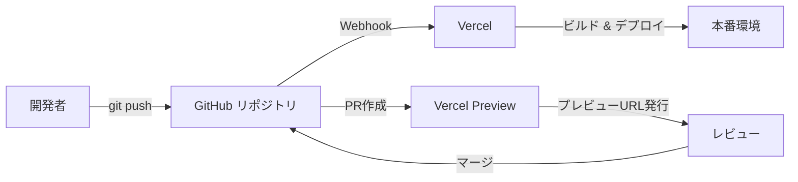
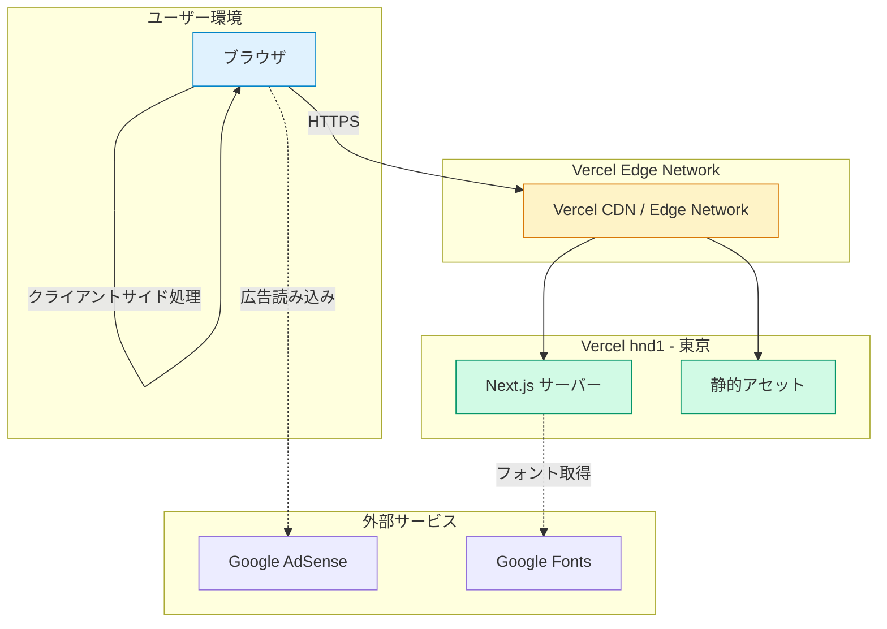
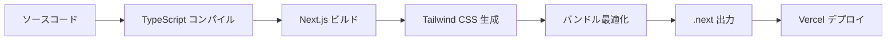
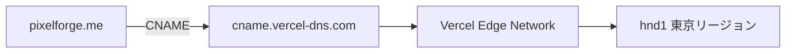

# インフラ設計書 — PixelForge

| 項目 | 内容 |
|------|------|
| プロジェクト名 | PixelForge |
| ドキュメント種別 | インフラ設計書 |
| 対象バージョン | 0.1.0 |
| 最終更新日 | 2026-03-22 |

---

## 目次

1. [デプロイ構成](#1-デプロイ構成)
2. [ビルド・デプロイパイプライン](#2-ビルドデプロイパイプライン)
3. [Next.js設定詳細](#3-nextjs設定詳細)
4. [パフォーマンス設計](#4-パフォーマンス設計)
5. [静的アセット管理](#5-静的アセット管理)
6. [SEO対応](#6-seo対応)
7. [PWA対応](#7-pwa対応)
8. [ドメイン・SSL](#8-ドメインssl)
9. [監視・分析](#9-監視分析)
10. [環境変数](#10-環境変数)

---

## 1. デプロイ構成

### 1.1 プラットフォーム概要

PixelForgeは **Vercel** をホスティングプラットフォームとして採用する。Vercelは Next.js の開発元が提供するプラットフォームであり、Next.js アプリケーションに対して最適化されたビルド・配信基盤を備える。

### 1.2 リージョン設定

`vercel.json` にて、デプロイリージョンを **hnd1（東京）** に指定する。

```json
{
  "framework": "nextjs",
  "regions": ["hnd1"]
}
```

| 設定項目 | 値 | 理由 |
|----------|-----|------|
| framework | `nextjs` | Next.js 最適化ビルドを有効化 |
| regions | `hnd1` | 主要ユーザーが日本国内のため、東京リージョンを選択しレイテンシを最小化 |

### 1.3 GitHub連携と自動デプロイ



| トリガー | デプロイ先 | URL |
|----------|-----------|-----|
| `main` ブランチへの push | 本番環境 (Production) | `https://pixelforge.me` |
| プルリクエスト作成・更新 | プレビュー環境 (Preview) | `https://<branch>-pixelforge.vercel.app` |

### 1.4 全体アーキテクチャ



**重要な設計方針**: 画像のリサイズ処理はすべてクライアントサイド（ブラウザ）で実行される。サーバーへの画像アップロードは一切行わず、ユーザーのプライバシーを保護する。このため、サーバーサイドの計算リソースは最小限で済む。

---

## 2. ビルド・デプロイパイプライン

### 2.1 ビルドコマンド

```json
{
  "scripts": {
    "dev": "next dev",
    "build": "next build",
    "start": "next start",
    "lint": "eslint"
  }
}
```

| コマンド | 用途 |
|----------|------|
| `next dev` | ローカル開発サーバー起動（HMR対応） |
| `next build` | 本番用ビルド生成（Vercelが自動実行） |
| `next start` | 本番サーバー起動（Vercel上では不使用） |
| `eslint` | コード静的解析 |

### 2.2 ビルドパイプライン



### 2.3 Vercel ビルド設定

| 項目 | 値 |
|------|-----|
| Framework Preset | Next.js |
| Build Command | `next build`（自動検出） |
| Output Directory | `.next`（自動検出） |
| Install Command | `npm install`（自動検出） |
| Node.js バージョン | 20.x（Vercel デフォルト） |

### 2.4 依存関係

#### 本番依存 (dependencies)

| パッケージ | バージョン | 用途 |
|-----------|-----------|------|
| `next` | 16.2.0 | フレームワーク本体 |
| `react` | 19.2.4 | UIライブラリ |
| `react-dom` | 19.2.4 | React DOM レンダラー |
| `framer-motion` | ^12.38.0 | アニメーション |
| `jszip` | ^3.10.1 | 一括処理時のZIP生成（クライアントサイド） |
| `lucide-react` | ^0.577.0 | アイコンライブラリ |
| `next-themes` | ^0.4.6 | ダーク/ライトモード切替 |
| `react-compare-slider` | ^3.1.0 | ビフォー/アフター比較UI |
| `zustand` | ^5.0.12 | 軽量状態管理 |

#### 開発依存 (devDependencies)

| パッケージ | バージョン | 用途 |
|-----------|-----------|------|
| `@tailwindcss/postcss` | ^4 | Tailwind CSS PostCSS プラグイン |
| `tailwindcss` | ^4 | CSSフレームワーク |
| `typescript` | ^5 | 型安全な開発 |
| `eslint` / `eslint-config-next` | ^9 / 16.2.0 | コード品質チェック |
| `@types/node`, `@types/react`, `@types/react-dom` | 各最新 | TypeScript 型定義 |

---

## 3. Next.js設定詳細

`next.config.ts` の全設定項目とその設計意図を以下に記載する。

### 3.1 reactStrictMode

```typescript
reactStrictMode: true,
```

| 項目 | 内容 |
|------|------|
| 値 | `true` |
| 目的 | React の厳格モードを有効化し、非推奨APIの使用や副作用の問題を開発時に検出する |
| 効果 | 開発環境でコンポーネントが二重レンダリングされ、副作用の不整合を早期発見できる。本番環境には影響なし |

### 3.2 images.unoptimized

```typescript
images: {
  unoptimized: true,
},
```

| 項目 | 内容 |
|------|------|
| 値 | `true` |
| 目的 | Next.js のサーバーサイド画像最適化を無効化する |
| 理由 | PixelForge は **クライアントサイドで画像処理を行うアプリケーション** である。ユーザーがアップロードした画像はサーバーに送信されず、ブラウザの Canvas API を使用してリサイズ・変換を行う。そのため、Next.js のサーバーサイド画像最適化機能は不要であり、無効化することでビルド構成を簡素化し、Vercel の画像最適化APIのコスト発生を回避する |

### 3.3 セキュリティヘッダー

```typescript
headers: async () => [
  {
    source: "/(.*)",
    headers: [
      { key: "X-Content-Type-Options", value: "nosniff" },
      { key: "X-Frame-Options", value: "DENY" },
      { key: "Referrer-Policy", value: "strict-origin-when-cross-origin" },
    ],
  },
],
```

すべてのルート (`/(.*)`) に対して以下のセキュリティヘッダーを付与する。

| ヘッダー | 値 | 目的 |
|---------|-----|------|
| `X-Content-Type-Options` | `nosniff` | ブラウザによるMIMEタイプスニッフィングを防止し、Content-Type ヘッダーで宣言された型を厳密に適用する。XSS攻撃の緩和 |
| `X-Frame-Options` | `DENY` | 当サイトが他サイトの `<iframe>` 内に埋め込まれることを完全に禁止する。クリックジャッキング攻撃の防止 |
| `Referrer-Policy` | `strict-origin-when-cross-origin` | 同一オリジンへのリクエストではフルURLを、クロスオリジンへのリクエストではオリジンのみを送信する。プライバシー保護とセキュリティのバランスを取る設定 |

### 3.4 TypeScript設定 (tsconfig.json)

| 設定 | 値 | 理由 |
|------|-----|------|
| `target` | ES2017 | 主要ブラウザで広くサポートされるターゲット |
| `strict` | true | 厳密な型チェックによるコード品質向上 |
| `module` | esnext | ESモジュール構文を使用 |
| `moduleResolution` | bundler | バンドラー（Next.js / webpack / turbopack）に最適化されたモジュール解決 |
| `jsx` | react-jsx | React 17+ の新しいJSX変換を使用 |
| `incremental` | true | インクリメンタルビルドによる開発速度向上 |
| `paths` (`@/*`) | `./src/*` | `@/` プレフィックスによるクリーンなインポートパス |

### 3.5 PostCSS設定

```javascript
const config = {
  plugins: {
    "@tailwindcss/postcss": {},
  },
};
```

Tailwind CSS v4 を PostCSS プラグインとして使用する。v4 では `@tailwindcss/postcss` パッケージにより、設定ファイルレスで動作する。

---

## 4. パフォーマンス設計

### 4.1 バンドルサイズ目標

| 指標 | 目標値 | 備考 |
|------|--------|------|
| 初回ロード JS (gzip) | **< 150 KB** | ファーストビューに必要な最小限のJSのみを配信 |
| 合計バンドルサイズ | 最小化 | Tree-shaking と code splitting で不要コードを排除 |

### 4.2 Core Web Vitals 目標

| 指標 | 目標値 | Google 基準 (Good) |
|------|--------|-------------------|
| **LCP** (Largest Contentful Paint) | **< 1.5 秒** | < 2.5 秒 |
| **CLS** (Cumulative Layout Shift) | **< 0.1** | < 0.1 |
| **FID** (First Input Delay) | **< 100 ms** | < 100 ms |

### 4.3 フォント最適化

`next/font/google` を使用して Google Fonts を最適化する。

```typescript
const geistSans = Geist({
  variable: "--font-geist-sans",
  subsets: ["latin"],
});

const geistMono = Geist_Mono({
  variable: "--font-geist-mono",
  subsets: ["latin"],
});
```

| フォント | CSS変数 | 用途 |
|---------|---------|------|
| Geist Sans | `--font-geist-sans` | UIテキスト全般 |
| Geist Mono | `--font-geist-mono` | 数値・コード表示 |

**最適化の仕組み**:
- ビルド時にフォントファイルをダウンロードし、セルフホスティングする
- Google Fonts CDN へのランタイムリクエストを排除
- `subsets: ["latin"]` により、不要なグリフを除外しファイルサイズを削減
- CSS変数を使用し、フォントの切り替えを柔軟に制御
- `font-display: swap` が自動適用され、フォント読み込み中もテキストが表示される（CLS低減）

### 4.4 コード分割戦略

```mermaid
graph TB
    subgraph 初回ロード
        FRAMEWORK[React / Next.js ランタイム]
        LAYOUT[レイアウト + グローバルCSS]
    end

    subgraph ページ単位分割
        HOME[/ トップページ]
        BATCH[/batch 一括処理]
    end

    subgraph 遅延読み込み
        MOTION[framer-motion]
        COMPARE[react-compare-slider]
        JSZIP[jszip]
        AD[AdSense Script]
    end

    FRAMEWORK --> HOME
    FRAMEWORK --> BATCH
    HOME -.->|動的import| MOTION
    HOME -.->|動的import| COMPARE
    BATCH -.->|動的import| JSZIP
    LAYOUT -.->|lazyOnload| AD
```

| 戦略 | 対象 | 方法 |
|------|------|------|
| ルート分割 | ページコンポーネント | Next.js App Router による自動分割 |
| ライブラリ遅延読み込み | framer-motion, jszip 等 | 必要なページでのみ読み込み |
| 広告スクリプト遅延 | AdSense | `strategy="lazyOnload"` でメインコンテンツ表示後に読み込み |
| Tree-shaking | lucide-react 等 | 使用するアイコンのみをバンドルに含める |

---

## 5. 静的アセット管理

### 5.1 public/ ディレクトリ構成

```
public/
├── ads.txt              # Google AdSense 認証ファイル
├── manifest.json        # PWA マニフェスト
├── icons/
│   ├── icon-192.svg     # PWA アイコン (192x192)
│   └── icon-512.svg     # PWA アイコン (512x512)
├── file.svg             # UIアイコン
├── globe.svg            # UIアイコン
├── next.svg             # Next.js ロゴ
├── vercel.svg           # Vercel ロゴ
└── window.svg           # UIアイコン
```

### 5.2 ファビコン

| ファイル | パス | 形式 | 説明 |
|---------|------|------|------|
| サイトアイコン | `src/app/icon.svg` | SVG | App Router の規約に従い、自動的に `<link rel="icon">` として配信 |
| Apple Touch Icon | `src/app/apple-icon.tsx` | 動的生成 | Apple デバイス向けアイコンをランタイム生成 |

SVG形式を採用することで、どのデバイス解像度でも鮮明に表示される。

### 5.3 OG画像

`src/app/opengraph-image.tsx` によりOG画像を動的に生成する。Next.js の ImageResponse API を使用し、ビルド時またはリクエスト時に画像を生成する。

### 5.4 静的アセットの配信

Vercel CDN を通じて配信され、以下の最適化が自動適用される。

- **CDNキャッシュ**: エッジロケーションにキャッシュされ、低レイテンシで配信
- **Brotli/Gzip圧縮**: テキストベースのアセットは自動圧縮
- **不変アセットのキャッシュ**: `_next/static/` 配下のアセットはコンテンツハッシュ付きファイル名で配信され、長期キャッシュ（`immutable`）が適用

---

## 6. SEO対応

### 6.1 メタデータ設定

`src/app/layout.tsx` で定義されるメタデータ。

| 項目 | 値 |
|------|-----|
| title (デフォルト) | `PixelForge — ブラウザ完結型 画像リサイズツール` |
| title (テンプレート) | `%s \| PixelForge` |
| description | ブラウザ上で画像をリサイズ。サーバーへのアップロード不要で、プライバシーを守ります。PNG, JPEG, WebP対応、品質調整も可能。 |
| metadataBase | `https://pixelforge.me` |
| canonical | `/` |
| lang | `ja` |

### 6.2 キーワード

```
画像リサイズ, 画像変換, 画像圧縮, ブラウザ, オンライン,
PNG, JPEG, WebP, 無料, プライバシー, PixelForge
```

### 6.3 Open Graph / Twitter Cards

| 項目 | OG | Twitter |
|------|-----|---------|
| title | PixelForge — ブラウザ完結型 画像リサイズツール | 同左 |
| description | ブラウザ上で画像をリサイズ。サーバーへのアップロード不要で、プライバシーを守ります。 | PNG, JPEG, WebP対応を追記 |
| type / card | `website` | `summary_large_image` |
| locale | `ja_JP` | - |
| siteName | `PixelForge` | - |
| image | `opengraph-image.tsx` で動的生成 | 同左 |

### 6.4 JSON-LD 構造化データ

`layout.tsx` 内に `WebApplication` スキーマを埋め込む。

```json
{
  "@context": "https://schema.org",
  "@type": "WebApplication",
  "name": "PixelForge",
  "url": "https://pixelforge.me",
  "description": "ブラウザ上で画像をリサイズ。サーバーへのアップロード不要で、プライバシーを守ります。PNG, JPEG, WebP対応、品質調整も可能。",
  "applicationCategory": "MultimediaApplication",
  "operatingSystem": "All",
  "browserRequirements": "Requires a modern web browser",
  "offers": {
    "@type": "Offer",
    "price": "0",
    "priceCurrency": "JPY"
  },
  "inLanguage": "ja"
}
```

| プロパティ | 値 | 効果 |
|-----------|-----|------|
| `@type` | WebApplication | Google がウェブアプリとして認識し、リッチリザルトに表示される可能性 |
| `applicationCategory` | MultimediaApplication | マルチメディアツールとしてカテゴリ分類 |
| `offers.price` | 0 | 無料アプリであることを検索エンジンに明示 |
| `inLanguage` | ja | 日本語コンテンツであることを明示 |

### 6.5 サイトマップ (sitemap.ts)

`src/app/sitemap.ts` で動的に生成される。

| URL | 更新頻度 | 優先度 |
|-----|---------|--------|
| `https://pixelforge.me` | monthly | 1.0 |
| `https://pixelforge.me/batch` | monthly | 0.8 |

生成URL: `https://pixelforge.me/sitemap.xml`

### 6.6 robots.ts

```typescript
{
  rules: {
    userAgent: "*",
    allow: "/",
  },
  sitemap: "https://pixelforge.me/sitemap.xml",
}
```

- すべてのクローラーに対してサイト全体のクロールを許可
- サイトマップの場所を明示

---

## 7. PWA対応

### 7.1 manifest.json

`public/manifest.json` で PWA (Progressive Web App) の基本設定を定義する。

```json
{
  "name": "PixelForge — 画像リサイズツール",
  "short_name": "PixelForge",
  "description": "ブラウザ完結型の画像リサイズツール。サーバーへのアップロード不要。",
  "start_url": "/",
  "display": "standalone",
  "background_color": "#ffffff",
  "theme_color": "#2563eb",
  "icons": [
    { "src": "/icons/icon-192.svg", "sizes": "192x192", "type": "image/svg+xml" },
    { "src": "/icons/icon-512.svg", "sizes": "512x512", "type": "image/svg+xml" }
  ]
}
```

| 設定 | 値 | 説明 |
|------|-----|------|
| `name` | PixelForge — 画像リサイズツール | インストール時・スプラッシュ画面に表示されるフル名称 |
| `short_name` | PixelForge | ホーム画面アイコン下に表示される短縮名 |
| `display` | standalone | ブラウザのUIを非表示にし、ネイティブアプリに近い表示 |
| `background_color` | #ffffff | スプラッシュ画面の背景色 |
| `theme_color` | #2563eb | ステータスバー・タイトルバーの色（ブルー系） |
| `start_url` | / | ホーム画面からの起動時に開くURL |

### 7.2 アイコン

SVG形式のアイコンを2サイズ提供する。SVGはベクター形式のため、実質的にどの解像度にも対応する。

| アイコン | サイズ | 用途 |
|---------|--------|------|
| `icon-192.svg` | 192x192 | ホーム画面アイコン |
| `icon-512.svg` | 512x512 | スプラッシュ画面・ストア表示用 |

### 7.3 テーマカラー連携

`layout.tsx` の `viewport` 設定と `manifest.json` の `theme_color` は同一の値 (`#2563eb`) に統一されている。

```typescript
export const viewport: Viewport = {
  themeColor: "#2563eb",
};
```

---

## 8. ドメイン・SSL

### 8.1 ドメイン構成

| 項目 | 値 |
|------|-----|
| 本番ドメイン | `pixelforge.me` |
| Vercel サブドメイン | `pixelforge.vercel.app`（自動リダイレクト） |
| プレビュー環境 | `<branch>-pixelforge.vercel.app` |

### 8.2 SSL/TLS

Vercel が SSL/TLS 証明書を自動管理する。

| 項目 | 内容 |
|------|------|
| 証明書発行 | Let's Encrypt による自動発行 |
| 更新 | Vercel が自動更新（手動操作不要） |
| プロトコル | TLS 1.2 以上 |
| HTTP → HTTPS | 自動リダイレクト |
| HSTS | Vercel により自動付与 |

### 8.3 DNS構成



---

## 9. 監視・分析

### 9.1 推奨ツール

| ツール | 用途 | 導入状態 |
|--------|------|---------|
| **Vercel Analytics** | トラフィック分析（PV、ユニークビジター、リファラー） | 推奨（未導入） |
| **Vercel Speed Insights** | Core Web Vitals のリアルユーザーモニタリング (RUM) | 推奨（未導入） |
| **Google AdSense レポート** | 広告収益・インプレッション分析 | ads.txt 設置済み |

### 9.2 Vercel Analytics 導入方針

Vercel Analytics はプライバシーに配慮した分析ツールであり、Cookie を使用しない。導入は Vercel ダッシュボードから有効化するのみで、コード変更は不要である（Pro プラン以上で利用可能な機能あり）。

### 9.3 Vercel Speed Insights 導入方針

Core Web Vitals の継続的な監視のため、導入を推奨する。`@vercel/speed-insights` パッケージを追加し、レイアウトコンポーネントに組み込む。

```typescript
// 導入時の追加イメージ
import { SpeedInsights } from "@vercel/speed-insights/next";
```

### 9.4 障害検知

| 項目 | 方法 |
|------|------|
| ビルドエラー | Vercel が自動検知し、デプロイを中止。GitHub PR にステータスを報告 |
| ランタイムエラー | Vercel Functions のログで確認可能 |
| 可用性 | Vercel のグローバルインフラによる高可用性（SLA 99.99%） |

---

## 10. 環境変数

### 10.1 現在の構成

PixelForge のコア機能（画像リサイズ）はすべてクライアントサイドで動作するため、**サーバーサイドの環境変数は不要** である。

### 10.2 AdSense パブリッシャーID

| 変数名 | 値の例 | 必須 | スコープ |
|--------|--------|------|---------|
| `NEXT_PUBLIC_ADSENSE_CLIENT` | `ca-pub-XXXXXXXXXXXXXXXX` | いいえ | クライアント |

**動作仕様**:
- `src/components/ad/AdScript.tsx` にて `process.env.NEXT_PUBLIC_ADSENSE_CLIENT` を参照
- 環境変数が未設定の場合、AdSense スクリプトは読み込まれない（`null` を返却）
- `strategy="lazyOnload"` により、広告スクリプトはページのメインコンテンツ読み込み後に遅延ロードされる

```typescript
export default function AdScript() {
  const adClient = process.env.NEXT_PUBLIC_ADSENSE_CLIENT;
  if (!adClient) return null;
  // ...
}
```

### 10.3 ads.txt

`public/ads.txt` に Google AdSense のパブリッシャー認証情報を静的ファイルとして配置する。

```
google.com, pub-8537120305452094, DIRECT, f08c47fec0942fa0
```

| フィールド | 値 | 説明 |
|-----------|-----|------|
| ドメイン | google.com | 広告配信元 |
| パブリッシャーID | pub-8537120305452094 | AdSense アカウント識別子 |
| 関係 | DIRECT | 直接的な広告販売関係 |
| 認証ID | f08c47fec0942fa0 | TAG-ID (Trustworthy Accountability Group) |

### 10.4 環境変数の設定場所

| 環境 | 設定方法 |
|------|---------|
| ローカル開発 | `.env.local` ファイル（Git管理外） |
| Vercel 本番 | Vercel ダッシュボード > Settings > Environment Variables |
| Vercel プレビュー | 同上（Preview 環境を選択して設定） |
