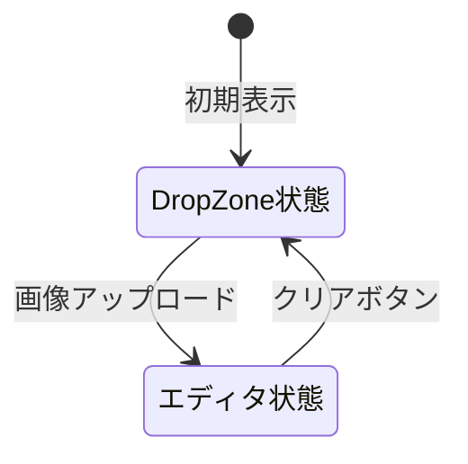
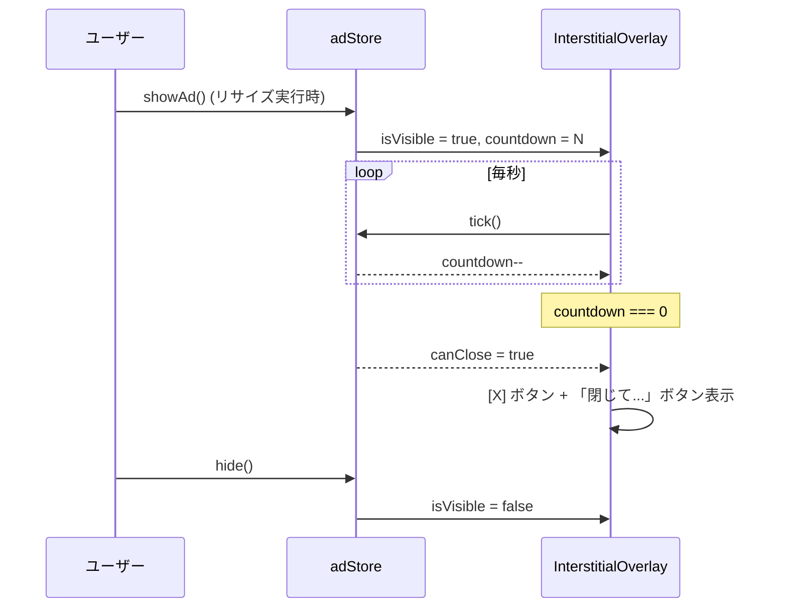

# PixelForge 画面設計書

| 項目       | 内容                                             |
| ---------- | ------------------------------------------------ |
| プロジェクト | PixelForge — ブラウザ完結型 画像リサイズツール     |
| 技術スタック | Next.js 16 / React 19 / Tailwind CSS 4 / Framer Motion |
| 最終更新日  | 2026-03-22                                       |

---

## 目次

1. [共通デザインシステム](#1-共通デザインシステム)
2. [共通レイアウト](#2-共通レイアウト)
3. [メイン画面 (/)](#3-メイン画面-)
4. [バッチ画面 (/batch)](#4-バッチ画面-batch)
5. [インタースティシャル広告](#5-インタースティシャル広告)
6. [レスポンシブデザイン](#6-レスポンシブデザイン)
7. [画面遷移アニメーション](#7-画面遷移アニメーション)
8. [アクセシビリティ](#8-アクセシビリティ)

---

## 1. 共通デザインシステム

### 1.1 カラーパレット

#### ライトモード

| 用途             | Tailwind クラス / 値                              |
| ---------------- | ------------------------------------------------ |
| 背景 (body)      | `bg-white`                                        |
| テキスト (primary) | `text-gray-900`                                  |
| テキスト (secondary) | `text-gray-500`, `text-gray-400`              |
| ボーダー         | `border-gray-200`, `border-gray-300`              |
| アクセントカラー  | `bg-blue-600`, `hover:bg-blue-700`               |
| ブランドグラデーション | `bg-gradient-to-r from-blue-600 to-purple-600` |
| エラー / 警告     | `text-red-600`                                   |
| 成功             | `text-green-500`                                  |
| アイコンカラー    | `text-blue-600`                                   |
| ドラッグ状態      | `border-blue-500 bg-blue-50`                     |
| サーフェス       | `bg-gray-50`, `bg-gray-100`                       |
| プライバシーバッジ | `bg-green-50 border-green-200 text-green-800`    |
| チェッカーボード  | `#e5e7eb` (gray-200 相当)                         |
| スクロールバー    | `#d1d5db` (gray-300 相当)                         |

#### ダークモード

| 用途             | Tailwind クラス / 値                                    |
| ---------------- | ------------------------------------------------------ |
| 背景 (body)      | `dark:bg-gray-950`                                      |
| テキスト (primary) | `dark:text-gray-100`                                  |
| テキスト (secondary) | `dark:text-gray-400`, `dark:text-gray-500`          |
| ボーダー         | `dark:border-gray-800`, `dark:border-gray-700`          |
| ブランドグラデーション | `dark:from-blue-400 dark:to-purple-400`            |
| アイコンカラー    | `dark:text-blue-400`                                    |
| ドラッグ状態      | `dark:bg-blue-950/30`                                  |
| サーフェス       | `dark:bg-gray-800`, `dark:bg-gray-900`                  |
| プライバシーバッジ | `dark:bg-green-950/30 dark:border-green-800 dark:text-green-300` |
| チェッカーボード  | `#374151` (gray-700 相当)                               |
| スクロールバー    | `#374151` (gray-700 相当)                               |

#### テーマカラー (meta)

```
themeColor: "#2563eb"  (blue-600)
```

### 1.2 タイポグラフィ

| 項目           | 設定                                               |
| -------------- | -------------------------------------------------- |
| プライマリフォント | Geist Sans (`--font-geist-sans`)                 |
| モノスペースフォント | Geist Mono (`--font-geist-mono`)               |
| フォント読み込み | `next/font/google` による最適化読み込み              |
| CSS 変数        | `--font-sans`, `--font-mono`                       |
| フォールバック   | Arial, Helvetica, sans-serif                       |
| アンチエイリアス | `antialiased` (html 要素に適用)                     |

主要なフォントサイズの使い分け:

| クラス       | 使用箇所                               |
| ------------ | -------------------------------------- |
| `text-2xl`   | バッチ画面の見出し                      |
| `text-lg`    | ロゴ、DropZone のメインテキスト         |
| `text-sm`    | ナビゲーション、説明文、ボタンテキスト   |
| `text-xs`    | ステータスラベル、ヘルプ内テキスト、フッター |
| `text-[10px]` | キーボードショートカットの kbd 要素     |

### 1.3 アイコン (lucide-react)

使用しているアイコン一覧:

| アイコン名               | 使用箇所                             |
| ----------------------- | ------------------------------------ |
| `ImageDown`             | ロゴ、単一処理ナビリンク              |
| `Layers`                | 一括処理ナビリンク                    |
| `Sun` / `Moon`          | テーマ切り替えボタン                  |
| `RotateCcw`             | クリアボタン                          |
| `HelpCircle`            | ヘルプパネル開閉                      |
| `X`                     | ヘルプパネル閉じる、バッチアイテム削除、広告閉じる |
| `Upload`                | DropZone 通常状態、BatchUploader      |
| `ImagePlus`             | DropZone ドラッグ中                   |
| `Scaling`               | ヘルプ手順3、一括リサイズボタン        |
| `Lock`                  | ヘルプ手順3 (アスペクト比ロック)       |
| `Download`              | ヘルプ手順4                           |
| `Keyboard`              | ショートカットキーセクション           |
| `Shield`                | プライバシーバッジ (ヘルプ + フッター)  |
| `Eye`                   | プレビューモード切替                   |
| `SplitSquareHorizontal` | 比較モード切替                        |
| `Loader2`               | 処理中スピナー (animate-spin)          |
| `CheckCircle2`          | バッチアイテム完了                     |
| `AlertCircle`           | バッチアイテムエラー                   |
| `Clock`                 | バッチアイテム待機中                   |
| `Percent`               | バッチ倍率指定タブ                     |
| `Ruler`                 | バッチ解像度指定タブ                   |

### 1.4 ダークモード実装

| 項目           | 詳細                                                  |
| -------------- | ---------------------------------------------------- |
| ライブラリ      | `next-themes`                                        |
| Provider       | `Providers` コンポーネントでラップ                     |
| カスタムバリアント | `@custom-variant dark (&:where(.dark, .dark *));`  |
| html 属性      | `suppressHydrationWarning` でハイドレーション警告抑制    |
| トグルロジック  | `useTheme()` の `theme` / `setTheme` で `dark` ⇔ `light` |
| マウント制御    | `mounted` state で SSR/CSR 不一致を回避                |

### 1.5 アニメーション (Framer Motion)

プロジェクト全体で使用しているアニメーションパターン:

#### パターン A: フェードイン + スライドアップ (DropZone)

```typescript
initial={{ opacity: 0, y: 20 }}
animate={{ opacity: 1, y: 0 }}
exit={{ opacity: 0, y: -20 }}
```

#### パターン B: フェードイン/アウト (エディタ切替)

```typescript
initial={{ opacity: 0 }}
animate={{ opacity: 1 }}
exit={{ opacity: 0 }}
```

#### パターン C: フェード + スケール (インタースティシャル広告)

```typescript
// 背景オーバーレイ
initial={{ opacity: 0 }}
animate={{ opacity: 1 }}
exit={{ opacity: 0 }}
transition={{ duration: 0.3 }}

// コンテンツカード
initial={{ opacity: 0, scale: 0.95 }}
animate={{ opacity: 1, scale: 1 }}
exit={{ opacity: 0, scale: 0.95 }}
transition={{ duration: 0.3 }}
```

#### AnimatePresence

- `<AnimatePresence mode="wait">` : メイン画面の DropZone ⇔ エディタ切替
- `<AnimatePresence>` : インタースティシャル広告の表示/非表示

### 1.6 カスタムスクロールバー

```
幅: 6px
トラック: transparent
サム (ライト): #d1d5db
サム (ダーク): #374151
角丸: 3px
```

### 1.7 数値入力スピンボタン

ブラウザデフォルトのスピンボタンを表示するように `opacity: 1` を設定。

---

## 2. 共通レイアウト

### 2.1 全体構成

```
+------------------------------------------------------------------+
| <html lang="ja" class="h-full antialiased">                      |
|   <body class="min-h-full flex flex-col">                        |
|     +----------------------------------------------------------+ |
|     | Providers (next-themes + その他)                          | |
|     |   +----------------------------------------------------+ | |
|     |   | Header (sticky top-0 z-50)                         | | |
|     |   +----------------------------------------------------+ | |
|     |   | <main class="flex-1">                              | | |
|     |   |   [ページ固有のコンテンツ]                           | | |
|     |   | </main>                                            | | |
|     |   +----------------------------------------------------+ | |
|     |   | Footer (mt-auto)                                   | | |
|     |   +----------------------------------------------------+ | |
|     |   | InterstitialOverlay (fixed z-[60])                 | | |
|     +----------------------------------------------------------+ |
|     | AdScript                                                   |
+------------------------------------------------------------------+
```

### 2.2 Header

```
+------------------------------------------------------------------+
| [ImageDown] PixelForge  画像リサイズ  |  [Nav] [?] [Theme] [Clear] |
+------------------------------------------------------------------+
```

#### 仕様

| 項目              | 値                                                    |
| ----------------- | ---------------------------------------------------- |
| 位置固定          | `sticky top-0 z-50`                                   |
| 背景              | `bg-white/80 dark:bg-gray-950/80 backdrop-blur-sm`   |
| 高さ              | `h-14`                                                |
| 最大幅            | `max-w-7xl mx-auto`                                  |
| パディング        | `px-4`                                                |
| 下線              | `border-b border-gray-200 dark:border-gray-800`      |

#### 左側要素

- **ロゴ**: `<Link href="/">` + `ImageDown` アイコン (w-6 h-6, blue-600/blue-400)
- **ブランド名**: グラデーションテキスト (`bg-gradient-to-r from-blue-600 to-purple-600`)
- **サブテキスト**: 「画像リサイズ」 (sm 以上で表示、`hidden sm:inline`)

#### 右側要素 (左から順)

1. **ナビゲーションリンク**: ページに応じて動的切替
   - メイン画面にいる場合: `[Layers] 一括処理` → `/batch`
   - バッチ画面にいる場合: `[ImageDown] 単一処理` → `/`
   - テキストは sm 以上で表示 (`hidden sm:inline`)
2. **ヘルプボタン**: `[HelpCircle]` — クリックでヘルプパネル開閉
3. **テーマ切替**: `[Sun]` or `[Moon]` — マウント後に表示
4. **クリアボタン**: `[RotateCcw] クリア` — 画像読み込み後にのみ表示 (赤色)

#### ヘルプパネル

| 項目       | 値                                                    |
| ---------- | ---------------------------------------------------- |
| 位置       | `absolute right-0 top-full mt-2`                      |
| 幅         | `w-80 sm:w-96`                                        |
| 背景       | `bg-white dark:bg-gray-900`                           |
| 影         | `shadow-xl`                                           |
| 角丸       | `rounded-xl`                                          |
| z-index    | `z-50`                                                |
| 最大高さ   | `max-h-[70vh] overflow-y-auto`                        |
| 閉じる方法 | 外側クリック / Escape キー / X ボタン                   |

ヘルプパネルの内容構成:

```
+----------------------------------------------+
| 使い方                                    [X] |
+----------------------------------------------+
| [基本的な流れ]                                |
|   1. 画像をアップロード                       |
|   2. サイズを設定                             |
|   3. リサイズを実行                           |
|   4. ダウンロード                             |
+----------------------------------------------+
| [便利な機能]                                  |
|   - アスペクト比ロック                        |
|   - ドット絵モード                            |
|   - ビフォー/アフター比較                     |
|   - 一括処理                                  |
|   - カスタムプリセット                        |
+----------------------------------------------+
| [ショートカットキー]                          |
|   Enter → リサイズ実行                        |
|   Ctrl+S → ダウンロード                       |
+----------------------------------------------+
| [Shield] プライバシー通知                     |
+----------------------------------------------+
```

### 2.3 Footer

```
+------------------------------------------------------------------+
| [Shield] すべての処理はブラウザ内で完結...       |    PixelForge  |
+------------------------------------------------------------------+
```

| 項目       | 値                                                |
| ---------- | ------------------------------------------------ |
| 上線       | `border-t border-gray-200 dark:border-gray-800`  |
| パディング | `py-4`                                            |
| 配置       | `mt-auto` (フレックスコンテナの最下部に固定)        |
| 最大幅     | `max-w-7xl mx-auto`                               |
| レイアウト | sm 以上: flex-row (左右), sm 未満: flex-col (縦並び) |
| テキスト   | `text-xs text-gray-500 dark:text-gray-400`        |

---

## 3. メイン画面 (/)

メイン画面は画像の読み込み状態に応じて 2 つの状態を持ち、`AnimatePresence mode="wait"` でアニメーション遷移する。



### 3.1 状態 A: DropZone (画像未読込)

画面中央にドラッグ＆ドロップ領域を配置。

```
+------------------------------------------------------------------+
| Header                                                            |
+------------------------------------------------------------------+
|                                                                    |
|                                                                    |
|              +------------------------------+                      |
|              |     ○  (Upload アイコン)      |                      |
|              |                              |                      |
|              |     画像をアップロード         |                      |
|              |   ドラッグ＆ドロップ           |                      |
|              |   または クリックして選択       |                      |
|              |                              |                      |
|              |   対応形式: JPEG, PNG, ...     |                      |
|              |                              |                      |
|              |   [ファイルを選択]             |                      |
|              +------------------------------+                      |
|                                                                    |
|                                                                    |
+------------------------------------------------------------------+
| Footer                                                            |
+------------------------------------------------------------------+
```

#### DropZone 仕様

| 項目           | 値                                                        |
| -------------- | -------------------------------------------------------- |
| 全体配置       | `flex items-center justify-center min-h-[60vh]`           |
| ドロップ領域幅  | `max-w-xl mx-auto`                                       |
| ボーダー       | `border-2 border-dashed rounded-2xl`                      |
| パディング     | `p-12`                                                    |
| カーソル       | `cursor-pointer`                                          |
| 通常状態       | `border-gray-300 dark:border-gray-700`                    |
| ホバー状態     | `hover:border-blue-400 hover:bg-gray-50`                  |
| ドラッグ中     | `border-blue-500 bg-blue-50 scale-[1.02]`                |
| アイコン       | 通常: `Upload` (w-10 h-10) / ドラッグ中: `ImagePlus`      |
| ボタン         | `bg-blue-600 hover:bg-blue-700 text-white rounded-lg`    |
| 対応形式       | JPEG, PNG, WebP, BMP, GIF, SVG                            |
| 非表示 input   | `<input type="file" class="hidden">` を ref で制御        |

#### アニメーション

- 表示時: opacity 0→1, y 20→0
- 退出時: opacity 1→0, y 0→-20

### 3.2 状態 B: エディタ (画像読込済)

2 カラムグリッドレイアウトで設定パネルとプレビューパネルを配置。

```
+------------------------------------------------------------------+
| Header                                             [Clear]        |
+------------------------------------------------------------------+
| Settings Panel (4/12)   |   Preview Panel (8/12)                  |
| +-----------+           |   +----------------------------------+  |
| | サイズ入力 |           |   | [プレビュー] [比較]               |  |
| |  幅 [____]|           |   +----------------------------------+  |
| |  高 [____]|           |   |                                  |  |
| |  [Lock]   |           |   |  ┌─────────────────────────┐     |  |
| +-----------+           |   |  │  チェッカーボード背景     │     |  |
| | 倍率プリセット |       |   |  │                         │     |  |
| |  25% 50% ...  |       |   |  │    画像プレビュー        │     |  |
| +-----------+           |   |  │                         │     |  |
| | SNS プリセット |       |   |  └─────────────────────────┘     |  |
| +-----------+           |   +----------------------------------+  |
| | カスタムプリセット |   |   | 画像情報                          |  |
| +-----------+           |   |   ファイル名 / 元サイズ → 新サイズ  |  |
| | 出力形式   |           |   +----------------------------------+  |
| | 品質スライダー |       |   | [ダウンロード]                    |  |
| | リサイズモード |       |   +----------------------------------+  |
| | Canvas 警告 |          |                                        |
| +-----------+           |                                        |
| [リサイズ実行]          |                                        |
+------------------------------------------------------------------+
| Footer                                                            |
+------------------------------------------------------------------+
```

#### グリッド仕様

| 項目       | 値                                                              |
| ---------- | --------------------------------------------------------------- |
| コンテナ   | `max-w-7xl mx-auto w-full`                                      |
| グリッド   | `grid grid-cols-1 lg:grid-cols-12`                               |
| 最小高さ   | `min-h-[calc(100vh-8rem)]`                                       |
| 設定列     | `lg:col-span-4 xl:col-span-3`                                   |
| プレビュー列 | `lg:col-span-8 xl:col-span-9`                                 |
| 仕切り     | モバイル: `border-b` / デスクトップ: `lg:border-r`               |

#### 設定パネル (SettingsPanel)

| 項目       | 値                                                |
| ---------- | ------------------------------------------------ |
| スクロール | `overflow-y-auto max-h-[calc(100vh-8rem)]`        |
| パディング | `p-4 lg:p-5`                                      |
| セクション間隔 | `space-y-5`                                   |

設定パネルのセクション構成 (上から順):

| # | コンポーネント      | 説明                                        |
| - | ------------------- | ------------------------------------------ |
| 1 | `DimensionInput`    | 幅 × 高さの数値入力、アスペクト比ロック       |
| 2 | `ScalePresets`      | 倍率プリセット (25%, 50%, 75%, 100%, 150%, 200% など) |
| 3 | `SnsPresets`        | SNS 用プリセット (Twitter, Instagram, YouTube など) |
| 4 | `CustomPresets`     | ユーザー保存カスタムプリセット               |
| 5 | `FormatSelect`      | 出力形式選択 (PNG / JPEG / WebP)             |
| 6 | `QualitySlider`     | 品質スライダー (PNG 時は無効)                 |
| 7 | `ResizeModeToggle`  | リサイズモード (スムージング有無 = ドット絵モード) |
| 8 | `CanvasWarning`     | Canvas サイズ制限の警告表示                   |
| 9 | `ResizeButton`      | 「リサイズ実行」ボタン                       |

#### プレビューパネル (PreviewPanel)

| 項目       | 値                             |
| ---------- | ------------------------------ |
| パディング | `p-4 lg:p-5`                   |
| セクション間隔 | `space-y-4`                |

プレビューパネルの構成 (上から順):

| # | コンポーネント    | 説明                                          |
| - | ---------------- | --------------------------------------------- |
| 1 | ビューモード切替  | `[Eye] プレビュー` / `[SplitSquareHorizontal] 比較` ボタン (リサイズ後に表示) |
| 2 | `ImagePreview`   | 画像プレビュー (チェッカーボード背景付き)        |
|   | `CompareSlider`  | ビフォー/アフター比較スライダー (比較モード時)    |
| 3 | `ImageInfo`      | ファイル名、元サイズ → リサイズ後サイズ、ファイルサイズ |
| 4 | `DownloadButton` | ダウンロードボタン (リサイズ未実行時は disabled)   |

#### ImagePreview 仕様

| 項目             | 値                                                  |
| ---------------- | -------------------------------------------------- |
| コンテナ         | `rounded-xl overflow-hidden border`                 |
| 背景             | チェッカーボードパターン (20px タイル)                |
| ライト背景色     | `#e5e7eb`                                           |
| ダーク背景色     | `#374151`                                           |
| 画像サイズ制約   | `max-w-full max-h-[50vh] object-contain mx-auto`   |

#### CompareSlider 仕様

| 項目       | 値                                                    |
| ---------- | ---------------------------------------------------- |
| ライブラリ | `react-compare-slider`                                |
| コンテナ   | `rounded-xl overflow-hidden border`                   |
| 高さ制約   | `max-h-[50vh]`                                        |
| 左側       | 元画像 (alt="元の画像")                                |
| 右側       | リサイズ後 (alt="リサイズ後")                           |

---

## 4. バッチ画面 (/batch)

複数画像の一括リサイズ画面。中央寄せの単一カラムレイアウト。

```
+------------------------------------------------------------------+
| Header                                             [Clear]        |
+------------------------------------------------------------------+
|                                                                    |
|   +----------------------------------------------------------+    |
|   | 一括リサイズ                                              |    |
|   | 複数の画像をまとめてリサイズし、ZIPでダウンロードできます     |    |
|   +----------------------------------------------------------+    |
|                                                                    |
|   +----------------------------------------------------------+    |
|   | BatchUploader (ドラッグ＆ドロップ領域)                     |    |
|   |   ○  画像をアップロード                                   |    |
|   |   ドラッグ＆ドロップ または クリックして選択 (最大N枚)      |    |
|   +----------------------------------------------------------+    |
|                                                                    |
|   +----------------------------------------------------------+    |
|   | 共通設定                                                  |    |
|   |  [倍率で指定] [解像度で指定]                               |    |
|   |  ┌──────┬──────┬──────┬──────┐                             |    |
|   |  │ 倍率  │ 形式  │ 品質  │ モード │                        |    |
|   |  └──────┴──────┴──────┴──────┘                             |    |
|   |  (解像度モード時: SNS プリセット表示)                      |    |
|   +----------------------------------------------------------+    |
|                                                                    |
|   +----------------------------------------------------------+    |
|   | N枚の画像 (M枚完了)                                       |    |
|   | +------------------------------------------------------+ |    |
|   | | [サムネ] ファイル名   1200×800 → 600×400   [状態] [X] | |    |
|   | +------------------------------------------------------+ |    |
|   | | [サムネ] ファイル名   ...                    [状態] [X] | |    |
|   | +------------------------------------------------------+ |    |
|   |                                                          |    |
|   | [すべてリサイズ (N枚)]                                    |    |
|   +----------------------------------------------------------+    |
|                                                                    |
|   +----------------------------------------------------------+    |
|   | BatchDownload (ZIP ダウンロードボタン)                     |    |
|   +----------------------------------------------------------+    |
|                                                                    |
+------------------------------------------------------------------+
| Footer                                                            |
+------------------------------------------------------------------+
```

### レイアウト仕様

| 項目       | 値                                        |
| ---------- | ---------------------------------------- |
| 最大幅     | `max-w-4xl mx-auto`                       |
| パディング | `px-4 py-8`                                |
| セクション間隔 | `space-y-6`                            |

### 4.1 BatchUploader

| 項目           | 値                                               |
| -------------- | ----------------------------------------------- |
| ボーダー       | `border-2 border-dashed rounded-xl`              |
| パディング     | `p-8`                                            |
| テキスト位置   | `text-center`                                    |
| カーソル       | `cursor-pointer`                                 |
| 通常状態       | `border-gray-300 dark:border-gray-700`           |
| ドラッグ中     | `border-blue-500 bg-blue-50 scale-[1.01]`       |
| 複数選択       | `<input multiple>` 対応                          |
| 最大枚数       | `MAX_BATCH_FILES` (定数)                         |

### 4.2 共通設定エリア (BatchList 内)

| 項目       | 値                                                        |
| ---------- | -------------------------------------------------------- |
| コンテナ   | `p-4 rounded-xl border bg-gray-50 dark:bg-gray-900`      |
| グリッド   | `grid grid-cols-1 md:grid-cols-2 lg:grid-cols-4 gap-4`   |

#### リサイズモードタブ

| モード       | アイコン    | ラベル       |
| ------------ | ---------- | ------------ |
| `scale`      | `Percent`  | 倍率で指定    |
| `dimensions` | `Ruler`    | 解像度で指定  |

- アクティブタブ: `bg-blue-600 text-white`
- 非アクティブ: `bg-white dark:bg-gray-800 border`

#### 設定グリッド (4 カラム)

| カラム | 倍率モード時            | 解像度モード時        |
| ------ | ---------------------- | -------------------- |
| 1      | 倍率プリセットボタン群  | 幅 × 高さ 数値入力    |
| 2      | `FormatSelect`         | `FormatSelect`       |
| 3      | `QualitySlider`        | `QualitySlider`      |
| 4      | `ResizeModeToggle`     | `ResizeModeToggle`   |

解像度モード選択時は、グリッド下部に `SnsPresets` が追加表示される。

### 4.3 BatchItem

```
+------------------------------------------------------------------+
| [サムネイル 48×48] | ファイル名.jpg          | [状態アイコン] [X]  |
|                    | 1200×800 → 600×400 (34KB)|                    |
+------------------------------------------------------------------+
```

| 項目         | 値                                                  |
| ------------ | -------------------------------------------------- |
| コンテナ     | `flex items-center gap-3 p-3 rounded-lg border`    |
| サムネイル   | `w-12 h-12 rounded-md overflow-hidden object-cover` |
| ファイル名   | `text-sm font-medium truncate`                      |
| サイズ情報   | `text-xs text-gray-400` 形式: `元W×元H → 新W×新H`   |
| リスト領域   | `max-h-[40vh] overflow-y-auto`                      |

#### ステータス表示

| ステータス    | アイコン        | ラベル   | 色                |
| ------------ | -------------- | -------- | ----------------- |
| `pending`    | `Clock`        | 待機中   | `text-gray-400`   |
| `processing` | `Loader2` (回転) | 処理中 | `text-blue-500`   |
| `done`       | `CheckCircle2` | 完了     | `text-green-500`  |
| `error`      | `AlertCircle`  | エラー   | `text-red-500`    |

### 4.4 リサイズ実行ボタン

| 項目       | 値                                                            |
| ---------- | ------------------------------------------------------------ |
| 幅         | `w-full`                                                      |
| スタイル   | `bg-blue-600 hover:bg-blue-700 text-white rounded-xl`        |
| パディング | `px-4 py-3`                                                   |
| 無効状態   | `disabled:bg-blue-400 dark:disabled:bg-blue-800`              |
| 処理中表示 | `[Loader2 animate-spin] 処理中... (M/N)`                     |
| 通常表示   | `[Scaling] すべてリサイズ (N枚)`                              |

---

## 5. インタースティシャル広告

リサイズ実行時にフルスクリーンオーバーレイとして表示される広告。

```
+==================================================================+
|                    (黒半透明 + backdrop-blur)                      |
|                                                                    |
|         +------------------------------------------+               |
|         | スポンサー               [N秒後に閉じ]    |               |
|         +------------------------------------------+               |
|         |                                          |               |
|         |           [AdSlot — 広告コンテンツ]        |               |
|         |                                          |               |
|         +------------------------------------------+               |
|         |  [閉じてリサイズ結果を表示]                |   ← canClose  |
|         +------------------------------------------+               |
|                                                                    |
+==================================================================+
```

### オーバーレイ仕様

| 項目           | 値                                                          |
| -------------- | ---------------------------------------------------------- |
| 位置           | `fixed inset-0`                                             |
| z-index        | `z-[60]` (Header の z-50 より上)                            |
| 背景           | `bg-black/70 backdrop-blur-sm`                              |
| 配置           | `flex items-center justify-center`                          |
| body スクロール | `overflow: hidden` を JS で制御                             |

### コンテンツカード仕様

| 項目       | 値                                                    |
| ---------- | ---------------------------------------------------- |
| 最大幅     | `max-w-md`                                            |
| マージン   | `mx-4`                                                |
| 背景       | `bg-white dark:bg-gray-900`                           |
| 角丸       | `rounded-2xl`                                         |
| 影         | `shadow-2xl`                                          |

### カウントダウン動作



### 状態遷移

| 状態                  | ヘッダー右側表示                          | フッター表示            |
| --------------------- | ---------------------------------------- | ---------------------- |
| カウントダウン中       | `{countdown}秒後に閉じられます` (テキスト) | (なし)                 |
| 閉じ可能 (`canClose`) | `[X]` ボタン                              | `[閉じてリサイズ結果を表示]` ボタン |

---

## 6. レスポンシブデザイン

### 6.1 ブレークポイント

Tailwind CSS 4 のデフォルトブレークポイントを使用:

| プレフィックス | 最小幅    | 主な用途                           |
| ------------- | --------- | ---------------------------------- |
| (なし)        | 0px       | モバイルファースト (基本スタイル)    |
| `sm`          | 640px     | ロゴサブテキスト表示、ナビテキスト表示、フッター横並び |
| `md`          | 768px     | バッチ設定 2 カラム                  |
| `lg`          | 1024px    | エディタ 2 カラム分割、バッチ設定 4 カラム |
| `xl`          | 1280px    | エディタ列比率変更 (3/9)             |

### 6.2 画面別レスポンシブ対応

#### メイン画面 — DropZone

| 要素         | モバイル          | デスクトップ (lg+) |
| ------------ | ----------------- | ------------------ |
| DropZone 幅  | ほぼ全幅 (mx-auto) | `max-w-xl` 中央固定 |
| レイアウト   | 同一              | 同一                |

#### メイン画面 — エディタ

| 要素             | モバイル (< lg)           | デスクトップ (lg+)                |
| ---------------- | ------------------------- | -------------------------------- |
| グリッド         | `grid-cols-1` (縦積み)    | `grid-cols-12`                    |
| 設定パネル       | 上部に全幅配置             | 左 4/12 列 (xl: 3/12)            |
| プレビューパネル | 下部に全幅配置             | 右 8/12 列 (xl: 9/12)            |
| パネル境界       | `border-b` (下線)          | `lg:border-r` (右線)             |

#### バッチ画面

| 要素         | モバイル           | デスクトップ (lg+)              |
| ------------ | ------------------ | ------------------------------ |
| コンテナ幅   | ほぼ全幅 (px-4)    | `max-w-4xl` 中央固定            |
| 設定グリッド | `grid-cols-1` (縦) | `lg:grid-cols-4` (4 カラム)     |
| md 中間      | `md:grid-cols-2`   | —                               |

#### Header

| 要素           | モバイル (< sm)         | デスクトップ (sm+)         |
| -------------- | ---------------------- | ------------------------- |
| サブテキスト   | `hidden`               | `sm:inline` 「画像リサイズ」 |
| ナビリンクラベル | アイコンのみ           | `sm:inline` テキスト表示   |
| クリアラベル   | アイコンのみ            | `sm:inline` 「クリア」     |
| ヘルプパネル幅 | `w-80`                  | `sm:w-96`                  |

#### Footer

| 要素       | モバイル (< sm) | デスクトップ (sm+)  |
| ---------- | -------------- | ------------------- |
| 配置       | `flex-col` 縦   | `sm:flex-row` 横    |

#### BatchItem ステータスラベル

| 要素       | モバイル (< sm) | デスクトップ (sm+)    |
| ---------- | -------------- | --------------------- |
| ラベル文字 | `hidden` (アイコンのみ) | `sm:inline` テキスト表示 |

---

## 7. 画面遷移アニメーション

### 7.1 メイン画面の状態遷移

```
DropZone ←→ エディタ
```

| 項目            | 値                                      |
| --------------- | --------------------------------------- |
| 制御コンポーネント | `<AnimatePresence mode="wait">`        |
| key 切替        | `key="dropzone"` ⇔ `key="editor"`      |
| 切替条件        | `image` の有無 (null / 非 null)          |
| mode            | `"wait"` — exit 完了後に enter 開始      |

#### DropZone → エディタ

1. DropZone: exit `{ opacity: 0, y: -20 }` — 上にスライドしながらフェードアウト
2. エディタ: initial `{ opacity: 0 }` → animate `{ opacity: 1 }` — フェードイン

#### エディタ → DropZone

1. エディタ: exit `{ opacity: 0 }` — フェードアウト
2. DropZone: initial `{ opacity: 0, y: 20 }` → animate `{ opacity: 1, y: 0 }` — 下からスライドインしながらフェードイン

### 7.2 インタースティシャル広告

| 項目            | 値                                |
| --------------- | -------------------------------- |
| 制御コンポーネント | `<AnimatePresence>`            |
| 表示条件        | `isVisible` (adStore)             |

#### 表示時

1. 背景: `opacity: 0 → 1` (duration: 0.3s)
2. カード: `opacity: 0, scale: 0.95 → opacity: 1, scale: 1` (duration: 0.3s)

#### 非表示時

1. カード: `opacity: 1, scale: 1 → opacity: 0, scale: 0.95`
2. 背景: `opacity: 1 → 0`

### 7.3 その他のトランジション

CSS トランジションベース:

| 対象                   | プロパティ         | クラス                    |
| ---------------------- | ------------------ | ------------------------ |
| ボタンホバー全般        | background-color   | `transition-colors`      |
| DropZone 全体          | all                | `transition-all duration-200` |
| BatchUploader          | all                | `transition-all duration-200` |
| ドラッグ中スケール      | transform          | `scale-[1.02]` / `scale-[1.01]` |

---

## 8. アクセシビリティ

### 8.1 キーボードショートカット

| キー           | 動作              | 条件                                           |
| -------------- | ----------------- | ---------------------------------------------- |
| `Enter`        | リサイズ実行       | 画像読込済み、処理中でない、INPUT 要素にフォーカスしていない |
| `Ctrl + S`     | ダウンロード       | リサイズ済み (`resizedDataUrl` あり)             |
| `Escape`       | ヘルプパネルを閉じる | ヘルプパネルが開いている時                       |

### 8.2 ARIA 属性

| 要素                   | 属性                               |
| ---------------------- | ---------------------------------- |
| h1 (メイン画面)       | `className="sr-only"` (スクリーンリーダー専用) |
| ヘルプボタン           | `aria-label="使い方を表示"`         |
| テーマ切替ボタン       | `aria-label="テーマを切り替える"`    |
| BatchItem 削除ボタン   | `aria-label="削除"`                 |
| 広告閉じるボタン       | `aria-label="閉じる"`               |

### 8.3 フォーカス管理

| シナリオ                 | 動作                                                |
| ----------------------- | --------------------------------------------------- |
| ヘルプパネル外クリック   | `mousedown` イベントで `helpRef` 外の場合パネルを閉じる |
| ヘルプパネル Escape     | `keydown` イベントで `Escape` キーでパネルを閉じる     |
| Enter キー除外          | `e.target.tagName === "INPUT"` の場合はリサイズ実行しない (入力中の誤操作防止) |
| Ctrl+S デフォルト抑制   | `e.preventDefault()` でブラウザの保存ダイアログを抑制  |

### 8.4 その他のアクセシビリティ考慮

| 項目                 | 実装                                               |
| -------------------- | -------------------------------------------------- |
| 言語設定             | `<html lang="ja">`                                  |
| カラーコントラスト   | gray-900 on white (ライト)、gray-100 on gray-950 (ダーク) |
| アンチエイリアス     | `antialiased` クラスでテキスト描画を最適化           |
| スクロール制御       | 広告オーバーレイ表示時に body スクロールを無効化      |
| 画像 alt テキスト    | プレビュー: "プレビュー" / 比較: "元の画像", "リサイズ後" |
| ステータスラベル     | BatchItem のアイコンに対応するテキストラベルあり (sm+) |
